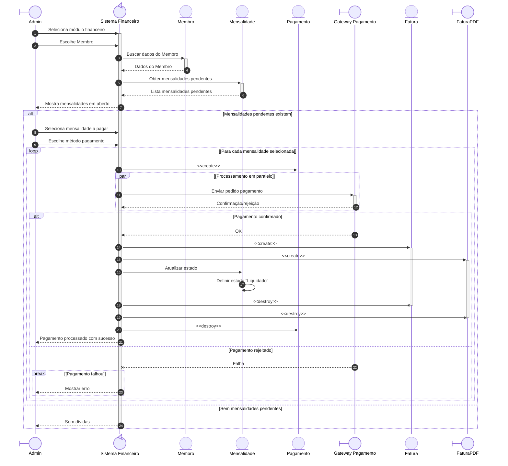
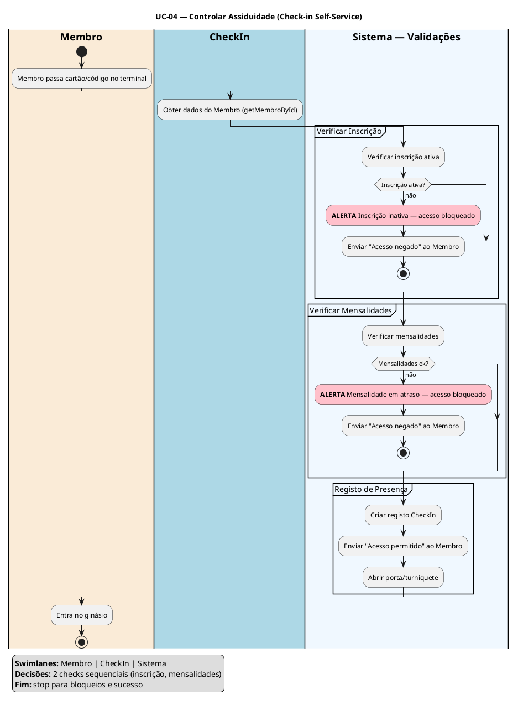

# Sistema de Gestão para Ginásio

## Modelação de Sistemas e Engenharia de Software

**Derlan Nascimento** | nº mec. 129942
**Micael Oliveira** | nº mec. 131700
**Rodrigo Fonseca** | nº mec. 131619
**Tiago Jacinto** | nº mec. 131339

_Programação de Sistema de Informação — Universidade de Aveiro_

Orientador: Professor José Martins

Águeda, 25 de março de 2026

---

## Índice

1. Introdução
2. Etapa 1 — Análise de Requisitos
   2.1. Descrição do Problema
   2.1.1. Descrição do Sistema
   2.1.2. Objetivo do Software
   2.1.3. Contexto de Utilização
   2.1.4. Principais Funcionalidades Esperadas
3. Stakeholders e Utilizadores
4. Identificação e Descrição dos Requisitos
   4.1. Requisitos Funcionais (RF)
   4.2. Requisitos Não Funcionais (RNF)
4.3. Casos de Uso
        UC-01 a UC-10

5. Etapa 2 — Modelação Estrutural
   5.1. Diagrama de Classes
   5.2. Diagramas de Sequência
   5.3. Diagrama de Atividades

---

## 1. Introdução

Hoje em dia há cada vez mais ginásios a abrir, mas muitos ainda fazem tudo em papel. Registos manuais, folhas de presenças, envelopes com pagamentos — o que torna difícil seguir a evolução de cada Membro e ajustar Planos de Treino.

Este trabalho apresenta um sistema digital para ginásios de pequena ou média dimensão. Substitui a papelada dispersa por uma plataforma integrada: regista dados biométricos e antropométricos, permite consultar horários e avaliações remotamente, e trata de inscrições, assiduidade e pagamentos.

---

## 2. Etapa 1 — Análise de Requisitos

### 2.1. Descrição do Problema

Muitos ginásios de pequena e média dimensão ainda dependem de processos manuais em papel — registos de presenças, folhas de inscrição, envelopes com pagamentos — o que dificulta o acompanhamento da evolução de cada membro, a gestão eficiente de horários e aulas de grupo, e a emissão atempada de faturas e comprovativos de pagamento.

### 2.1.1. Descrição do Sistema

Plataforma digital centralizada que gere todos os processos operacionais de um ginásio — desde o registo de membros e avaliação física até à gestão de horários, inscrições e faturação — eliminando a dependência de processos manuais em papel.

### 2.1.2. Objetivo do Software

Automatizar e centralizar a gestão operacional do ginásio, melhorando a eficiência dos processos, garantindo a conformidade documental dos membros e proporcionando uma melhor experiência tanto aos colaboradores quanto aos utentes.

### 2.1.3. Contexto de Utilização

O sistema é utilizado em ambiente de ginásio por diversos perfis — rececionistas no controlo de acessos e atendimento, treinadores na avaliação física e prescrição de planos de treino, e administradores na gestão de inscrições, pagamentos e relatórios — operando principalmente em tablets e computadores de balcão com necessidade de resposta rápida e fiável.

### 2.1.4. Principais Funcionalidades Esperadas

- Registo de membros: criar, consultar por nome ou número, atualizar e desativar registos de Membros.
- Avaliação antropométrica: registar peso, altura e outros dados físicos de um Membro à escolha do Treinador.
- Planos de treino: prescrever Exercícios personalizados com séries, repetições, carga e descanso num PlanoTreino.
- Inscrições: criar, renovar e cancelar Inscrições em Modalidades.
- Assiduidade: Check-in e Check-out por cartão ou código.
- Financeiro: geração automática de Mensalidades, registo de Pagamentos totais ou parciais, emissão de Faturas e Comprovativos.
- Aulas de grupo: criar horários de AulaGrupo, reservar e cancelar vagas, controlo de lotação máxima e lista de espera.
- Modalidades: criar, consultar e desativar Modalidades com valores mensais.
- Validação documental: verificação automática da inscrição ativa antes de Check-in. Exame médico é validado apenas no momento da inscrição.
- Aplicação móvel: acesso via app mobile para membros consultarem planos, reservarem aulas e efetuarem check-in.
- Relatórios de faturação: compilação de receitas e valores em dívida por período.
- Autenticação e perfis de acesso: login com sessão autenticada (expiração em 30 min), hash bcrypt para passwords e controlo de acesso por perfil (Membro, Treinador, Rececionista, Gestor, Admin).

---

## 3. Stakeholders e Utilizadores

### 1. Atores Principais
| Ator | O que fazem |
| --- | --- |
| **Membro** | Paga quota, marca aulas, regista presenças, vê planos de treino e histórico |
| **Treinador** | Cria planos de treino, acompanha progresso dos membros, dá aulas coletivas e sessões PT |

### 2. Atores Secundários

| Ator | O que fazem |
| --- | --- |
| **Rececionista** | Faz check-in, atende pessoas ao balcão, processa pagamentos avulsos no POS |

### 3. Administradores

| Ator | O que fazem |
| --- | --- |
| **Gestor** | Gere o dia-a-dia — membros, staff, horários e relatórios; acesso total exceto configurações de negócio |
| **Admin** | Tarefas quotidianas de receção e atendimento — sem acesso a configurações de negócio |

### 4. Sistemas Externos

| Sistema | O que fazem |
| --- | --- |
| **Gateway de Pagamento** | Stripe, Razorpay, Square, GoCardless, Authorize.net — processa quotas, pagamentos avulsos e faturas |
| **Serviços de Notificação** | SMS, Email, WhatsApp — lembra renovações, notifica sobre aulas, confirma pagamentos, envia alertas |

---

## 4. Identificação e Descrição dos Requisitos

Os requisitos dividem-se em funcionais (o que o sistema faz) e não funcionais (como se comporta), organizados em sete domínios de negócio: gestão de utentes, avaliação física e planos de treino, inscrições/contratos/seguros, assiduidade, pagamentos/faturação, aulas de grupo e autenticação/perfis de acesso.

---

### 4.1. Requisitos Funcionais (RF)

| ID    | Título                             | Requisito funcional                                                                                                                                                                                                                               | Prioridade |
| ----- | ---------------------------------- | ------------------------------------------------------------------------------------------------------------------------------------------------------------------------------------------------------------------------------------------------- | ---------- |
| RF-01 | Criar Registo de Utente            | O Admin cria um novo utente com nome, contactos e foto. O sistema atribui um número único.                                                                                                              | Alta       |
| RF-02 | Consultar Utente por Nome         | O Admin pesquisa um utente por nome. O sistema mostra os dados guardados.                                                                                                                                                   | Alta       |
| RF-03 | Consultar Utente por Número       | O Admin pesquisa um utente pelo seu número único. O sistema mostra os dados guardados.                                                                                                                                       | Alta       |
| RF-04 | Atualizar Registo de Utente         | O Admin altera dados de um utente existente. O sistema regista a data da alteração.                                                                                                                                        | Alta       |
| RF-05 | Desativar Registo de Utente         | O Admin altera o estado de um utente para inativo. Um utente inativo não pode fazer login nem novas inscrições, mas os dados mantêm-se acessíveis para consulta histórica.                                                                                                   | Média      |
| RF-07 | Criar Plano de Treino               | O Treinador cria um plano de treino para um Membro, com um objetivo e uma duração.                                                                                                                                                                | Alta       |
| RF-09 | Criar Inscrição em Modalidade       | O Admin cria uma inscrição associando um Membro a uma Modalidade e definindo o período de validade.                                                                                                                          | Alta       |
| RF-10 | Renovar Inscrição                   | O Admin renova uma inscrição ativa antes da data de fim. O sistema atualiza o período de validade.                                                                                                                       | Alta       |
| RF-11 | Cancelar Inscrição                  | O Admin cancela uma inscrição activa. O sistema regista a data e o motivo do cancelamento.                                                                                                                                  | Média      |

**Fluxo Alternativo:** Se o Membro pedir cancelamento, o sistema regista o cancelamento.

| RF-12 | Registar Entrada (Check-in)        | O Membro ou a Rececionista regista a entrada no ginásio. O sistema valida que a inscrição ativa e, quando aplicável, que o exame médico está válido.                                                                                                                                           | Alta       |
| RF-13 | Validar e Guardar Hora de Entrada   | O sistema guarda a hora de entrada após validar que a inscrição está activa.                                                                                                                                                                        | Alta       |
| RF-14 | Registar Presença                  | O sistema regista a entrada e saída do Membro num único registo de presença. Permite calcular o tempo de permanência.                                                                                                                    | Alta       |
| RF-17 | Gerar Mensalidades                  | No dia 1 de cada mês, o sistema gera automaticamente as mensalidades para todos os utentes com inscrição ativa. **Derivação: processo automático (sistema/timer) — sem UC dedicado.**                                                                                 | Alta       |
| RF-18 | Registar Pagamento                  | A Rececionista ou o sistema regista o pagamento de uma mensalidade.                                                                                                                    | Alta       |
| RF-19 | Emitir Comprovativo de Pagamento    | Após a confirmação de um pagamento, o sistema gera um comprovativo.                                                                                                                                                                          | Média      |
| RF-20 | Criar Aula de Grupo                 | O Treinador cria uma AulaGrupo com horário, duração, lotação máxima e Treinador, para um dia da semana. Depois de criada, a aula fica disponível para reserva. **Derivação: processo de gestão de recursos — estende UC-11 (Gerir Modalidades) para aulas de grupo.** | Alta       |
| RF-21 | Reservar Vaga em Aula               | O Membro ou a Rececionista reserva um lugar numa AulaGrupo disponível. Se a aula estiver cheia, o sistema informa o Membro. O Membro pode entrar na lista de espera.                                                                                                                    | Alta       |
| RF-22 | Cancelar Reserva de Aula            | O Membro ou a Rececionista cancela uma reserva antes do início da aula. O sistema liberta a vaga.                                                                                                                                               | Média      |
| RF-23 | Controlar Lotação Máxima            | O sistema impede reservas quando a lotação máxima da aula é atingida.                                                                                                                                                                            | Alta       |
| RF-24 | Compilar Dados de Faturação          | O sistema compila receitas e valores em dívida para o período selecionado. **Derivação: UC-10 (passo 2 — compilar).**                                                                                                                                                                       | Alta       |
| RF-25 | Gerar Relatório de Faturação        | O sistema gera um relatório consolidado de faturação para o período selecionado. **Derivação: UC-10 (passo 3 — gerar). Nota: passo sequencial a RF-24; podem ser fundidos.**                                                                                                                       | Alta       |
| RF-26 | Gerir Modalidades                   | O responsável administrativo cria, consulta, atualiza e desativa Modalidades. Cada modalidade tem nome, descrição e valor mensal. Modalidades desativadas não podem ser usadas em novas inscrições.                                                                                   | Alta       |
| RF-28 | Emitir Fatura                       | Após o registo de um pagamento, o sistema gera automaticamente uma fatura com número, valor total e data de emissão.                                                                                                                    | Alta       |
| RF-29 | Aplicação Móvel                     | O Membro pode aceder via app mobile para consultar planos de treino, reservar aulas, visualizar histórico e efetivar check-in.                                                                                                              | Alta       |
| RF-32 | Gerir Lista de Espera               | Quando uma AulaGrupo está lotada, o Membro pode entrar na lista de espera. O sistema notifica o Membro quando uma vaga fica disponível, e confirma ou cancela a reserva dentro de 24 horas.                                                                                      | Alta       |

---

### 4.2. Requisitos Não Funcionais (RNF)

| ID       | Domínio           | Título                           | Descrição                                                                                                                                                                                                                                                                 | Prioridade |
| -------- | ----------------- | -------------------------------- | -------------------------------------------------------------------------------------------------------------------------------------------------------------------------------------------------------------------------------------------------------------------------- | ---------- |
| RNF-01a | Desempenho        | Tempo de Check-in             | O sistema processa check-in em menos de 1 segundo, utilizando os dados de CheckIn e a validação da inscrição ativa do Membro.                                                                                                                                  | Alta       |
| RNF-01b | Desempenho        | Consulta de Dados de Membro       | Consultas aos dados de Membro (Membro, AvaliacaoFisica, PlanoTreino) respondem em menos de 2 segundos.                                                                                                                                                                     | Alta       |
| RNF-01c | Desempenho        | Geração de Relatórios            | Relatórios de evolução (Relatorio) para períodos até 12 meses ficam prontos em até 120 segundos.                                                                                                                                                                          | Média      |
| RNF-02a | Segurança         | Autenticação por Password         | passwords de todos os Utilizador (Membro, Treinador, Rececionista, Admin, etc.) são guardadas com hash bcrypt.                                                                                                | Alta       |
| RNF-02b | Segurança         | Tempo de Expiração de Sessão      | Sessões autenticadas expiram após 30 minutos sem atividade.                                                                                                                                                          | Alta       |
| RNF-02c | Segurança         | Controlo de Acesso por Perfil     | O sistema implementa RBAC — cada Utilizador tem um perfil (Admin, Gestor, Rececionista, Treinador) que determina as permissões disponíveis.                                                                                                | Alta       |
| RNF-02e | Segurança         | Proteção contra Vulnerabilidades   | Todos os inputs são validados e sanitizados para prevenir injeção SQL e XSS.                                                                                                                                                                                               | Alta       |
| RNF-02f | Segurança         | Backup Encriptado                  | O sistema realiza backups regulares com encriptação adequada para proteger dados sensíveis. Backups são verificados quanto à integridade.                                                                                                                                                                  | Alta       |
| RNF-03a | Usabilidade       | Eficiência de Interação            | Operações frequentes (criar Inscricao, Check-in, registar Pagamento) necessitam no máximo 3 cliques a partir do dashboard autenticado.                                                                                                                                     | Alta       |
| RNF-04a | Disponibilidade   | Disponibilidade Operativa          | Sistema disponível 95% do tempo em período de funcionamento (08:00–22:00), e 90% fora dessas horas. Tempo máximo de indisponibilidade contínua: 2 horas. O sistema mantém dados protegidos contra perdas acidentais incluindo dados de freeze e histórico de lista de espera.                                                                                                                                         | Alta       |
| RNF-04b | Disponibilidade   | Recuperação após Incidente         | Após indisponibilidade durante horário de funcionamento, o sistema recupera em até 2 horas. Administrador recebe alerta automático.                                                                                                                                     | Alta       |
| RNF-05a | Privacidade de Dados | Minimização de Dados             | O sistema recolhe apenas dados biométricos necessários para a AvaliacaoFisica. Não são recolhidos dados clínicos, genéticos ou sinais vitais avançados.                                                                                                                    | Alta       |
| RNF-05b | Privacidade de Dados | Finalidade dos Dados             | Dados biométricos são usados exclusivamente para finalidades comunicadas ao titular. Para outra finalidade, é necessário consentimento explícito.                                                                                                                             | Alta       |
| RNF-05c | Privacidade de Dados | Direitos dos Titulares          | Titulares podem aceder, corrigir ou eliminar os seus dados através de interface dedicada. Tempo médio de resolução ≤ 30 dias úteis.                                                                                                                                          | Alta       |
| RNF-06a | Compatibilidade   | Compatibilidade de Browsers        | Interface web funciona nas versões mais recentes do Chrome, Firefox, Safari e Edge. Compatibilidade com Safari (iOS) e Chrome (Android).                                                                                                                                     | Média      |
| RNF-06b | Compatibilidade   | Suporte Multi-Dispositivo          | Interface responsiva para funcionar em desktops, tablets e smartphones. Funcionalidade completa em ecrãs de 320px até 2560px de largura.                                                                                                                                | Média      |
| RNF-06c | Compatibilidade   | Escalabilidade                     | O sistema suporta crescimento de pelo menos 50% no número de Membros e transações sem degradação de desempenho. Infraestrutura permite escalar horizontalmente.                                                                                                          | Média      |
| RNF-07a | Fiabilidade       | Proteção de Dados                  | O sistema mantém os dados de Membro, Inscricao e Pagamento protegidos contra perdas acidentais. Backups automáticos diários com verificação de integridade.                                                                                                                                                                     | Alta       |
| RNF-07b | Fiabilidade       | Restaurabilidade                   | Restaurabilidade total em até 8 horas a partir dos backups após desastre. Plano documentado e testado uma vez por ano.                                                                                                                                              | Alta       |
| RNF-09a | Segurança         | Retry de Pagamento Automático      | Após falha de débito automático, o sistema tenta novamente de forma razoável. Número máximo de tentativas definido por configuração.                                                                                                                                 | Alta       |
| RNF-09b | Segurança         | Método de Pagamento Padrão        | O Membro pode definir um PaymentMethod como padrão para débitos automáticos. O sistema tenta o método padrão primeiro.                                                                                                                                 | Alta       |
| RNF-10a | Usabilidade       | Janela de Cancelamento de Aula     | Reservas podem ser canceladas sem penalização até 24 horas antes do início da aula. Cancelamentos dentro de 24 horas são marcados como no-show.                                                                                                                                 | Alta       |
| RNF-10b | Usabilidade       | Notificação de Vaga em Lista de Espera | Quando uma vaga fica disponível numa aula lotada, o sistema notifica o primeiro Membro na lista de espera via SMS/email. O Membro tem 24 horas para confirmar; caso contrário, a vaga passa ao seguinte.                                                                                                                                 | Alta       |

---

### 4.3. Casos de Uso

Os casos de uso mostram a sequência de interações entre um ator e o sistema para atingir um objetivo específico.

---

#### UC-01 — Gerir Registo de Utentes

| Campo             | Valor                                                                                        |
| ----------------- | -------------------------------------------------------------------------------------------- |
| **Ator principal** | Admin |
| **Pré-condições** | Utilizador autenticado com perfil Admin. |
| **Descrição**     | Criar, consultar, editar e inativar registos de utentes.                                      |
| **Classes**       | Membro, Admin, Utilizador |

**Fluxo Principal**

1. O Admin abre o módulo de gestão de utentes.
2. Cria um novo registo ou pesquisa um existente.
3. Preenche ou atualiza os dados biográficos do Membro.
4. O sistema valida os dados e guarda o registo.

**Fluxo Alternativo**

Se houver um NIF duplicado, o sistema bloqueia a gravação e propõe abrir esse registo.

**Pós-condições** — Quando criado ou atualizado, o Membro fica pronto para inscrições e avaliações. Quando inativado, os dados mantêm-se acessíveis para consulta histórica, mas o sistema impede novas inscrições.

---

#### UC-02 — Efetuar Inscrição em Modalidade

| Campo             | Valor                                                                                       |
| ----------------- | ------------------------------------------------------------------------------------------- |
| **Ator principal** | Admin |
| **Pré-condições** | Membro registado no sistema. |
| **Descrição**     | Regista o Membro numa Modalidade.                                    |
| **Classes**       | Inscricao, Membro, Modalidade, Admin |

**Fluxo Principal**

1. Selecionar o Membro registado.
2. Escolher a Modalidade e o regime de frequência.
3. Definir a data de início do vínculo.
4. O sistema regista a inscrição e cobra a taxa de inscrição.

**Pós-condições** — O Membro fica associado à Modalidade e fica com um débito pendente.

---

#### UC-03 — Processar Pagamento de Mensalidade

| Campo             | Valor                                                                                                                               |
| ----------------- | ----------------------------------------------------------------------------------------------------------------------------------- |
| **Ator principal** | Admin                                                                                                            |
| **Pré-condições** | Membro com mensalidades pendentes. Colaborador com acesso ao módulo financeiro.                                                   |
| **Descrição**     | Regista o pagamento das mensalidades mensais.                                                                                          |
| **Classes**       | Mensalidade, Pagamento, Fatura, Comprovativo, Membro, Admin |

**Fluxo Principal**

1. O sistema mostra as mensalidades em aberto do Membro escolhido.
2. O Admin escolhe o mês a pagar e a forma de pagamento.
3. O sistema regista a transação e gera o comprovativo.
4. A mensalidade passa para "Liquidado".

**Fluxo Alternativo**

Se o pagamento falhar ou for recusado, o sistema avisa o colaborador e a mensalidade continua "Pendente".

**Pós-condições** — A mensalidade fica liquidada ou parcialmente paga, conforme o caso.

---

#### UC-04 — Controlar Assiduidade (Check-in)

| Campo             | Valor                                                                                             |
| ----------------- | ------------------------------------------------------------------------------------------------- |
| **Ator principal** | Membro ou Rececionista                                                                          |
| **Pré-condições** | Membro com inscrição ativa (e exame médico válido, quando exigido pela modalidade) e código ou cartão de acesso.        |
| **Descrição**     | Regista a presença do Membro nas instalações, usando um quiosque, interface web ou atendimento na receção.
| **Classes**       | Membro, Inscricao, Mensalidade, CheckIn, SistemaControloAcesso, Rececionista |

**Fluxo Principal (Self-Service)**

1. O Membro passa o código ou cartão no ponto de entrada.
2. Após confirmar que a inscrição está ativa, o sistema regista a hora de entrada e permite o acesso.

**Fluxo Alternativo (Assistido)**

Quando o Membro informa a receção ou apresenta o identificador de acesso:
1. A Rececionista consulta o sistema para validar a inscrição e o estado da mensalidade.
2. O sistema regista a hora de entrada.

**Fluxo de Exceção**

Se a inscrição estiver inválida ou o exame médico estiver em falta (quando exigido pela modalidade), o sistema bloqueia o acesso e encaminha o Membro para regularizar.

**Pós-condições** — A presença fica registada no sistema.

---

---

#### UC-05 — Realizar Avaliação Física

| Campo             | Valor                                                                                            |
| ----------------- | ------------------------------------------------------------------------------------------------ |
| **Ator principal** | Treinador                                                                              |
| **Pré-condições** | Membro presente. Treinador com acesso ao módulo técnico.                   |
| **Descrição**     | O Treinador regista dados básicos de conditionamento físico do Membro.     |
| **Classes**       | AvaliacaoFisica, Membro, Treinador |

**Fluxo Principal**

1. O Treinador introduz os dados de conditionamento físico do Membro.
2. É apresentado um relatório comparativo com a avaliação anterior, se existir.

**Pós-condições** — Os dados ficam guardados no histórico do Membro e servem de base para prescrever Planos de Treino.

---

#### UC-06 — Prescrever Plano de Treino

| Campo             | Valor                                                                                                                                                          |
| ----------------- | -------------------------------------------------------------------------------------------------------------------------------------------------------------- |
| **Ator principal** | Treinador                                                                              |
| **Pré-condições** | Membro com avaliação física válida e recente. Treinador autenticado.                                                                  |
| **Descrição**     | Criar uma rotina de exercícios e atribuir a um Membro.                                                                                   |
| **Classes**       | PlanoTreino, Exercicio, Membro, Treinador |

**Fluxo Principal**

1. O Treinador seleciona exercícios disponíveis.
2. Define parâmetros de treino.
3. Associa o Plano de Treino ao Membro com data de validade.
4. O sistema regista a prescrição e gera a ficha de treino.

**Pós-condições** — O Plano de Treino fica no perfil do Membro, pronto para ser consultado.

---

#### UC-07 — Consultar Histórico de Evolução

| Campo             | Valor                                                                                                                |
| ----------------- | -------------------------------------------------------------------------------------------------------------------- |
| **Ator principal** | Treinador |
| **Pré-condições** | Membro com pelo menos duas avaliações físicas registadas.                               |
| **Descrição**     | Ver como os dados biométricos do Membro mudaram ao longo do tempo.                                           |
| **Classes**       | AvaliacaoFisica, Membro, Treinador, Relatorio |

**Fluxo Principal**

1. O Treinador escolhe o Membro e pede o histórico de evolução.
2. O sistema vai buscar os dados de todas as avaliações feitas.
3. Mostra um gráfico com a evolução ao longo do tempo.
4. O Treinador pode descarregar o relatório.

**Pós-condições** — O relatório fica disponível e serve de base para ajustar os Planos de Treino.

---

#### UC-08 — Autenticar no Sistema

| Campo             | Valor                                                                                                        |
| ----------------- | ------------------------------------------------------------------------------------------------------------ |
| **Ator principal** | Qualquer utilizador registado com conta ativa.           |
| **Pré-condições** | Utilizador com conta ativa criada pelo administrador.                            |
| **Descrição**     | O utilizador introduz as suas credenciais, o sistema valida-as e cria uma sessão com acesso às funcionalidades apropriadas ao perfil.                         |
| **Classes**       | Utilizador, LogAuditoria |

**Fluxo Principal**

1. O utilizador escreve o identificador e a password.
2. Se as credenciais forem válidas e a conta estiver ativa, o sistema cria a sessão.
3. O utilizador vê as funcionalidades disponíveis para o seu perfil.

**Fluxo Alternativo**

Se as credenciais forem inválidas, o sistema recusa o acesso e mostra uma mensagem de erro.
Quando a conta está desativada, o sistema bloqueia o acesso e informa o utilizador de que deve contactar o administrador.

**Pós-condições** — A sessão fica ativa e o utilizador está no painel do seu perfil.

---

#### UC-09 — Reservar Aula de Grupo

| Campo             | Valor                                                                                                       |
| ----------------- | ----------------------------------------------------------------------------------------------------------- |
| **Ator principal** | Membro                                                                                                |
| **Descrição**     | O Membro marca presença numa AulaGrupo com lugares limitados.                                        |
| **Classes**       | Reserva, AulaGrupo, Membro |

**Fluxo Principal**

1. O Membro escolhe a aula no calendário.
2. O sistema verifica se há vagas disponíveis.
3. Se tudo correr bem, a reserva é confirmada e a lotação da AulaGrupo é atualizada.
4. **Cancelamento sem penalização: até 24 horas antes do início da aula. Após esse prazo, a vaga é perdida.**

**Fluxo Alternativo**

Quando a AulaGrupo está cheia, o sistema informa o Membro de que não há vagas disponíveis.

**Pós-condições** — A reserva fica confirmada e a vaga é subtraída ao inventário da AulaGrupo.

---

#### UC-10 — Gerar Relatórios de Faturação

| Campo             | Valor                                                                                                       |
| ----------------- | ----------------------------------------------------------------------------------------------------------- |
| **Ator principal** | Gestor                                                                                          |
| **Pré-condições** | Transações financeiras registadas no período escolhido.                          |
| **Descrição**     | O Gestor extrai e consolida dados financeiros para análise de gestão.                                       |
| **Classes**       | Relatorio, Mensalidade, Pagamento, Fatura, Gestor |

**Fluxo Principal**

1. O Gestor escolhe o período temporal.
2. O sistema calcula o total de receitas e identifica valores em dívida.
3. Gera-se um relatório consolidado.

**Fluxo Alternativo**

Se não existirem transações no período, o sistema informa o Gestor e não gera relatório.

**Pós-condições** — O relatório fica disponível para exportar em formato digital.

---

#### UC-11 — Gerir Modalidades

| Campo             | Valor                                                                                                       |
| ----------------- | ----------------------------------------------------------------------------------------------------------- |
| **Ator principal** | Gestor                                                                                          |
| **Pré-condições** | Utilizador autenticado com perfil Gestor.                          |
| **Descrição**     | Criar, consultar, atualizar e desativar Modalidades.                                       |
| **Classes**       | Modalidade, Gestor |

**Fluxo Principal**

1. O Gestor acede ao módulo de gestão de modalidades.
2. Cria uma nova modalidade com nome, descrição e valor mensal, ou edita uma existente.
3. O sistema valida os dados e guarda a modalidade.

**Fluxo Alternativo**

Se a modalidade estiver a ser utilizada por inscrições ativas, o sistema impede a desativação e informa o Gestor.

**Pós-condições** — A modalidade fica disponível para inscrições ou desativada conforme o caso.

---

---

## 5. Etapa 2 — Modelação Estrutural

### 5.1. Diagrama de Classes

```mermaid
classDiagram
    direction TB

class Utilizador {
    -String id
    -String nome
    -String email
    -String perfil # Admin, Gestor, Rececionista, Treinador
    +getId() String
    +getNome() String
    +getEmail() String
    +getPerfil() String
    +verificarPermissao(acao String) Boolean
}

class Membro {
    -String telefone
    -DateTime dataInscricao
    +criar(nome, email, telefone, estado) Membro
    +getTelefone() String
    +getDataInscricao() DateTime
    +setTelefone(telefone) void
}

class Treinador {
    -String telefone
    -String especialidade
    +criar(nome, email, especialidade, estado) Treinador
    +getTelefone() String
    +getEspecialidade() String
    +setTelefone(telefone) void
    +setEspecialidade(especialidade) void
}

class Rececionista {
    +criar(nome, email, estado) Rececionista
}

class Gestor {
    +criar(nome, email, estado) Gestor
}

class Admin {
    +criar(nome, email, estado) Admin
}

Membro --|> Utilizador
Treinador --|> Utilizador
Rececionista --|> Utilizador
Gestor --|> Utilizador
Admin --|> Utilizador

class Inscricao {
        -DateTime dataInicio
        -DateTime dataFim
        -String estado  // ativa, suspensa, cancelada
        +criar(dataInicio, dataFim, estado) Inscricao
        +getDataInicio() DateTime
        +getDataFim() DateTime
        +getEstado() String
    }

class AvaliacaoFisica {
    -String dadosFisicos
    -DateTime dataAvaliacao
    +criar(dadosFisicos, dataAvaliacao) AvaliacaoFisica
    +getDadosFisicos() String
    +getDataAvaliacao() DateTime
}

    class PlanoTreino {
        -String objetivo
        -DateTime dataValidade
        +criar(objetivo, dataValidade) PlanoTreino
        +getObjetivo() String
        +getDataValidade() DateTime
    }

class Sala {
        -String nome
        -Int lotacaoMax
        +criar(nome, lotacaoMax) Sala
        +getNome() String
        +getLotacaoMax() Int
    }

    class AulaGrupo {
        -String nome
        -String nivel
        +criar(nome, nivel) AulaGrupo
        +getNome() String
        +getNivel() String
    }

    class AulaSessao {
        -DateTime data
        -String estado
        -String diaSemana
        -String horaInicio
        -Int duracao
        +criar(data, estado, diaSemana, horaInicio, duracao) AulaSessao
        +getData() DateTime
        +getEstado() String
        +getDiaSemana() String
        +getHoraInicio() String
        +getDuracao() Int
    }

    class PaymentMethod {
        -String tipo
        -String ultimo4Digitos
        -DateTime dataExpiracao
        +criar(tipo, ultimo4Digitos, dataExpiracao) PaymentMethod
        +getTipo() String
        +getUltimo4Digitos() String
        +getDataExpiracao() DateTime
    }

    class ListaEspera {
        -DateTime dataPedido
        -String estado
        +criar(dataPedido) ListaEspera
        +getDataPedido() DateTime
        +getEstado() String
    }

    class Reserva {
        -DateTime dataReserva
        -String estadoReserva
        +criar(dataReserva) Reserva
        +getDataReserva() DateTime
        +getEstadoReserva() String
    }

    class CheckIn {
        -DateTime dataHora
        +criar(dataHora) CheckIn
        +getDataHora() DateTime
    }

    class SistemaControloAcesso {
        +validarAcesso(codigo String) Boolean
        +abrirPorta() void
    }

    class Exercicio {
        -String nome
        -Int series
        -Int repeticoes
        -Float carga
        -Int descansoSegundos
        +criar(nome, series, repeticoes, carga, descansoSegundos) Exercicio
        +getNome() String
        +getSeries() Int
        +getRepeticoes() Int
        +getCarga() Float
        +getDescansoSegundos() Int
    }

    class LogAuditoria {
        -DateTime timestamp
        -String acao
        -String utilizador
        -String detalhes
        +criar(acao, utilizador, detalhes) LogAuditoria
        +getTimestamp() DateTime
        +getAcao() String
        +getUtilizador() String
        +getDetalhes() String
    }

    class Comprovativo {
        -String numero
        -DateTime dataEmissao
        -Float valor
        -String descricao
        +criar(numero, valor, descricao) Comprovativo
        +getNumero() String
        +getDataEmissao() DateTime
        +getValor() Float
        +getDescricao() String
    }

    class Mensalidade {
        -Float valor
        -DateTime dataVencimento
        +criar(valor, dataVencimento) Mensalidade
        +getValor() Float
        +getDataVencimento() DateTime
    }

class Fatura {
    -String numero
    -Float valorTotal
    -DateTime dataEmissao
    +criar(numero, valorTotal) Fatura
    +getNumero() String
    +getValorTotal() Float
    +getDataEmissao() DateTime
}

class Pagamento {
    -Float valor
    -DateTime dataPagamento
    -String metodo
    +criar(valor, metodo) Pagamento
    +getValor() Float
    +getDataPagamento() DateTime
    +getMetodo() String
}

    class Modalidade {
    -String nome
    -String descricao
    -Float valorMensal
    -DateTime dataInicio
    -DateTime dataFim
    +criar(nome, descricao, valorMensal, dataInicio, dataFim) Modalidade
    +getNome() String
    +getDescricao() String
    +getValorMensal() Float
    +getDataInicio() DateTime
    +getDataFim() DateTime
}

    class Relatorio {
        -String tipo
        -String periodo
        -DateTime dataGeracao
        +criar(tipo, periodo) Relatorio
        +getTipo() String
        +getPeriodo() String
        +getDataGeracao() DateTime
        +gerar() String
    }

    Membro "1" --> "*" Inscricao : efetua
    Membro "1" --> "*" AvaliacaoFisica : recebe
    Membro "1" --> "*" PlanoTreino : recebe
    Membro "1" --> "*" Reserva : faz
Membro "1" --> "*" CheckIn : regista
    SistemaControloAcesso "1" --> "*" CheckIn : valida
    Membro "1" --> "*" SistemaControloAcesso : usa

    Treinador "1" --> "*" AvaliacaoFisica : realiza

    PlanoTreino "1" --> "*" Exercicio : contem
    Exercicio "1" --> "*" PlanoTreino : pertence

    Utilizador "1" --> "*" LogAuditoria : gera

    Rececionista "1" --> "*" CheckIn : processa
    Rececionista "1" --> "*" Pagamento : regista
    Rececionista "1" --> "*" Inscricao : gere
    Rececionista "1" --> "*" Reserva : processa
    Membro "1" --> "*" AvaliacaoFisica : realiza

    Rececionista "1" --> "*" CheckIn : processa
    Rececionista "1" --> "*" Pagamento : regista
    Rececionista "1" --> "*" Inscricao : gere
    Rececionista "1" --> "*" Reserva : processa

    Gestor "1" --> "*" Fatura : supervisiona
    Gestor "1" --> "*" Mensalidade : supervisiona
    Gestor "1" --> "*" Pagamento : supervisiona
    Gestor "1" --> "*" Relatorio : gera

    Gestor "1" --> "*" Membro : gere
    Gestor "1" --> "*" AulaGrupo : supervisiona
    Gestor "1" --> "*" Relatorio : consulta

    Admin "1" --> "*" Membro : gere

    Modalidade "1" --> "*" Inscricao : referencedBy

    AulaGrupo "1" --> "*" AulaSessao : cria
    AulaSessao "1" --> "1" Sala : ocorreEm
    AulaSessao "1" --> "1" Treinador : ministradaPor
    AulaSessao "1" --> "*" Reserva : contem
    AulaGrupo "1" --> "*" AulaSessao : geraSessoes

    Membro "1" --> "*" ListaEspera : solicita
    ListaEspera "1" --> "1" AulaSessao : para

    Membro "1" --> "*" PaymentMethod : tem
    PaymentMethod "1" --> "*" Pagamento : usa

    Mensalidade "1" --o "*" Pagamento : contem
    Mensalidade "1" --> "1" Fatura : tem
    ```

### 5.2. Diagramas de Sequência

#### 5.2.1. Sequência de UC-04 — Controlar Assiduidade (Check-in)

```mermaid
sequenceDiagram
    autonumber

    participant Membro@{ "type" : "boundary" } as Membro
    participant SistemaControloAcesso@{ "type" : "control" } as SistemaControloAcesso
    participant CheckIn@{ "type" : "entity" } as CheckIn

    Membro->>+SistemaControloAcesso: Passa cartão/código no terminal
    SistemaControloAcesso->>+Membro: getMembroById()
    Membro-->>-SistemaControloAcesso: Dados do Membro

    SistemaControloAcesso->>+Inscricao: verificarInscricaoAtiva()
    alt Inscrição ativa
        SistemaControloAcesso->>+Mensalidade: verificarMensalidades()
        alt Mensalidades regularizadas
            SistemaControloAcesso->>+CheckIn: <<create>> criar(dataHora)
            CheckIn-->>-SistemaControloAcesso: CheckIn criado
            SistemaControloAcesso->>+SistemaControloAcesso: abrirPorta()
            Note over SistemaControloAcesso: ALERTA: Acesso permitido — porta aberta
            SistemaControloAcesso-->>Membro: Acesso permitido
        else Mensalidades em atraso
            Note over SistemaControloAcesso: ALERTA: Mensalidade em atraso — acesso bloqueado
            SistemaControloAcesso--xMembro: Acesso negado — mensalidade em atraso
        end
    else Inscrição inativa
        Note over SistemaControloAcesso: ALERTA: Inscrição inativa — acesso bloqueado
        SistemaControloAcesso--xMembro: Acesso negado — inscrição inativa
    end
```

#### 5.2.2. Sequência de UC-03 — Processar Pagamento de Mensalidade



### 5.3. Diagrama de Atividades (UC-04)

