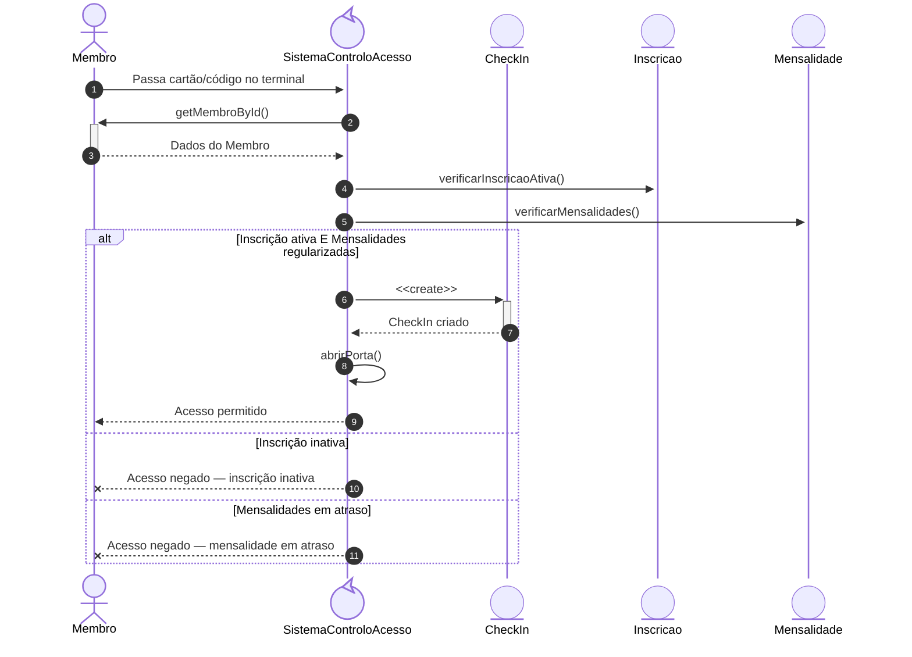
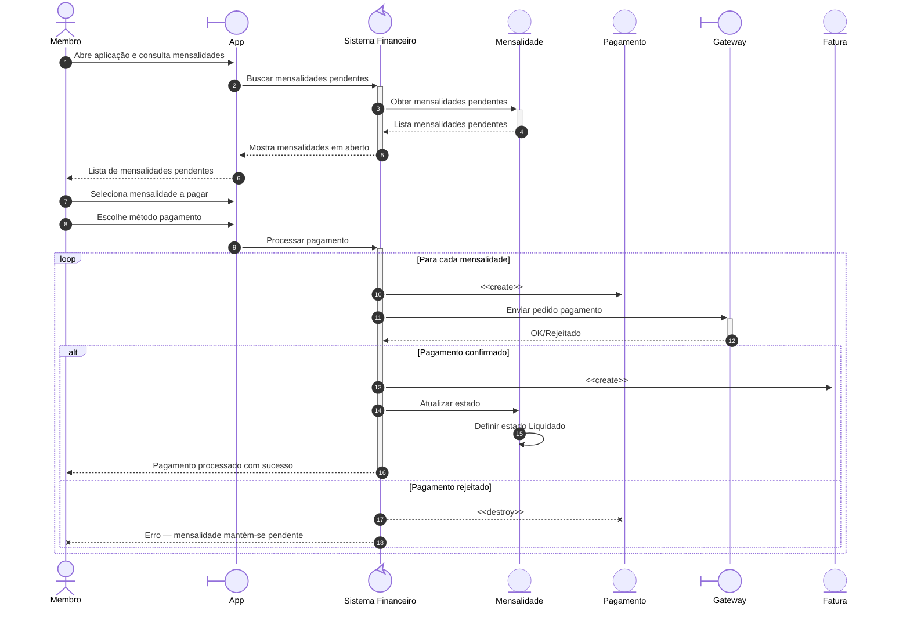
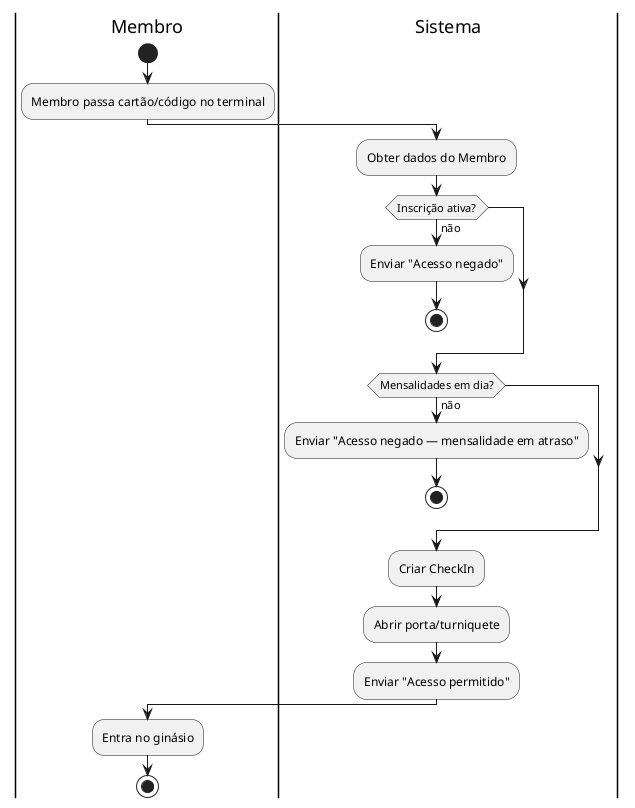

<nav id="table-of-contents">

## Índice

1. [Introdução](#1-introdução)
2. [Etapa 1 — Análise de Requisitos](#2-etapa-1--análise-de-requisitos)
   - [Descrição do Problema](#21-descrição-do-problema)
     - [Descrição do Sistema](#211-descrição-do-sistema)
     - [Objetivo do Software](#212-objetivo-do-software)
     - [Contexto de Utilização](#213-contexto-de-utilização)
     - [Principais Funcionalidades Esperadas](#214-principais-funcionalidades-esperadas)
3. [Stakeholders e Utilizadores](#3-stakeholders-e-utilizadores)
   - [Atores Principais](#31-atores-principais)
   - [Atores Secundários](#32-atores-secundários)
   - [Administradores](#33-administradores)
   - [Sistemas Externos](#34-sistemas-externos)
4. [Identificação e Descrição dos Requisitos](#4-identificação-e-descrição-dos-requisitos)
   - [Requisitos Funcionais (RF)](#41-requisitos-funcionais-rf)
     - [RF-01 — Membro](#rf-01--membro)
     - [RF-02 — Inscrição](#rf-02--inscrição)
     - [RF-03 — Plano de Treino](#rf-03--plano-de-treino)
     - [RF-04 — Exercício](#rf-04--exercício)
     - [RF-05 — Assiduidade](#rf-05--assiduidade)
     - [RF-06 — Autenticação](#rf-06--autenticação)
     - [RF-07 — Mensalidade](#rf-07--mensalidade)
     - [RF-08 — Fatura](#rf-08--fatura)
     - [RF-09 — Aula de Grupo](#rf-09--aula-de-grupo)
     - [RF-10 — Relatório](#rf-10--relatório)
     - [RF-11 — Sala](#rf-11--sala)
     - [RF-12 — Método de Pagamento](#rf-12--método-de-pagamento)
   - [Requisitos Não Funcionais (RNF)](#42-requisitos-não-funcionais-rnf)
5. [Casos de Uso](#43-casos-de-uso)
6. [Etapa 2 — Modelação Estrutural](#5-etapa-2--modelação-estrutural)
   - [Diagrama de Classes](#51-diagrama-de-classes)
   - [Diagramas de Sequência](#52-diagramas-de-sequência)
   - [Diagrama de Atividades](#53-diagrama-de-atividades)

</nav>

---

## 1. Introdução

 Muitos ginásios pequenos ainda funcionam com papel: folhas de presença em caderno, envelopes com dinheiro de pagamentos, notas manuscritas sobre o estado de cada membro. Isto complica o acompanhamento de cada pessoa e torna a gestão do dia-a-dia mais difícil do que precisa de ser.

 Este trabalho descreve um sistema digital para ginásios de pequena e média dimensão. A ideia é ter num só sítio a gestão de membros, inscrições, horários de aulas, presenças e pagamentos — em vez de depender de papel.

 ---

 ## 2. Etapa 1 — Análise de Requisitos

 ### 2.1. Descrição do Problema

 Ginásios de pequena e média dimensão ainda usam processos manuais em papel: folhas de inscrição, envelopes com pagamentos, registos de presença em caderno. O resultado é um acompanhamento irregular dos membros, horários imprevisíveis e faturas que só aparecem quando alguém se lembra de as emitir.

 ### 2.1.1. Descrição do Sistema

 Plataforma digital que cobre todas as operações de um ginásio: registo de membros, planos de treino, gestão de horários, inscrições e faturação.

 ### 2.1.2. Objetivo do Software

 Tornar a gestão do ginásio mais eficiente e centralizada. Na prática: processos mais rápidos para a equipa, documentação de membros em conformidade, e uma experiência melhor para quem treina.

 ### 2.1.3. Contexto de Utilização

 O sistema é usado no dia-a-dia do ginásio por diferentes perfis em paralelo. A receção trata de acessos, atendimento e pagamentos presenciais. Treinadores preenchem planos de treino. Administradores tratam de inscrições e gestão de membros. Pagamentos são feitos pelo membro via app ou presencialmente no balcão com ajuda do(a) rececionista. O trabalho decorre sobretudo em tablets e computadores de balcão.

 ### 2.1.4. Principais Funcionalidades Esperadas

 - **Membros:** criar, procurar por nome ou número, atualizar e desativar registos.
 - **Planos de treino:** exercícios personalizados com séries, repetições, carga e descanso.
 - **Inscrições:** criar, renovar e cancelar inscrições.
 - **Assiduidade:** check-in e check-out por cartão ou código.
 - **Financeiro:** mensalidades geradas automaticamente, pagamentos totais ou parciais, faturas.
 - **Aulas de grupo:** horários, reservas, cancelamentos e controlo de lotação.
 - **Validação automática:** a inscrição é verificada no check-in.
 - **App para membros:** consulta de planos, reserva de aulas e check-in pelo telemóvel.
 - **Relatórios de faturação:** receitas e valores em dívida por período.
 - **Segurança:** login com sessão que expira após 30 min sem atividade, passwords com hash bcrypt, e acesso por tipo de utilizador (Membro, Treinador, Rececionista, Gestor, Admin).

---

## 3. Stakeholders e Utilizadores

### 3.1. Atores Principais

| Ator | O que fazem |
| --- | --- |
| **Membro** | Paga mensalidade, marca aulas, regista presenças, vê planos de treino e histórico |
| **Treinador** | Cria planos de treino, acompanha progresso dos membros, dá aulas coletivas e sessões PT |

### 3.2. Atores Secundários

| Ator | O que fazem |
| --- | --- |
| **Rececionista** | Faz check-in, atende pessoas ao balcão, processa pagamentos avulsos no terminal POS |

### 3.3. Administradores

| Ator | O que fazem |
| --- | --- |
| **Gestor** | Gere o dia-a-dia: membros, staff, horários e relatórios. Acesso total exceto configurações de negócio. |
| **Admin** | Faz Receção e atendimento correntes. Sem acesso a configurações de negócio.

### 3.4. Sistemas Externos

| Sistema | O que fazem |
| --- | --- |
| **Gateway de Pagamento** | Integra Stripe, Razorpay, Square, GoCardless, Authorize.net para processar mensalidades, pagamentos avulsos e faturas |
| **Serviços de Notificação** | SMS, email, WhatsApp para lembrar renovações, confirmar pagamentos e enviar alertas |

---

## 4. Identificação e Descrição dos Requisitos

### 4.1. Requisitos Funcionais (RF)

#### RF-01 — Membro

**RF-01a — Criar Registo de Membro**  
O Admin cria um membro com nome, contactos e foto. O sistema atribui um número único.  
UC: UC-01a  
RNF: RNF-03a, RNF-05a, RNF-05b  
Prioridade: Alta

**RF-01b — Pesquisar Membro**  
O Admin pesquisa um membro por nome, número único ou outro critério. O sistema apresenta os dados guardados.  
UC: UC-01b  
RNF: RNF-03a, RNF-05a, RNF-05b  
Prioridade: Alta

**RF-01c — Atualizar Registo de Membro**  
O Admin atualiza dados de um membro. O sistema regista a data da alteração.  
RNF: RNF-03a, RNF-05a, RNF-05b  
Prioridade: Alta

**RF-01d — Inativar Registo de Membro**  
O Admin inativa um membro. O membro não pode fazer login nem novas inscrições, mas os dados ficam disponíveis para consulta histórica.  
RNF: RNF-04a  
Prioridade: Média

---

#### RF-02 — Inscrição

**RF-02a — Criar Inscrição**  
O Admin cria uma inscrição para um membro e define o período de validade.  
UC: UC-02  
RNF: RNF-03a, RNF-05a, RNF-05b  
Prioridade: Alta

**RF-02b — Renovar Inscrição**  
O Admin renova uma inscrição ativa antes da data de fim.  
UC: UC-02  
RNF: RNF-03a, RNF-04a, RNF-05a  
Prioridade: Alta

**RF-02c — Cancelar Inscrição (Admin)**  
O Admin cancela uma inscrição ativa. O sistema regista a data e o motivo do cancelamento.  
RNF: RNF-04a, RNF-05a  
Prioridade: Média

**RF-02d — Requerer Cancelamento (Membro)**  
O Membro requer o cancelamento da sua inscrição. O sistema regista o pedido.  
RNF: RNF-04a, RNF-05a  
Prioridade: Média

**RF-02e — Atualizar Inscrição**  
O Admin atualiza dados de uma inscrição ativa — período de validade ou plano associado. O sistema regista a data da alteração.  
RNF: RNF-03a, RNF-05a  
Prioridade: Média

---

#### RF-03 — Plano de Treino

**RF-03a — Criar Plano de Treino**  
O Treinador cria um plano de treino para um membro, com um objetivo e uma duração.  
UC: UC-05  
RNF: RNF-03a, RNF-05a  
Prioridade: Alta

**RF-03b — Atualizar Plano de Treino**  
O Treinador atualiza um plano existente de um membro, incluindo exercícios, séries, repetições, carga, descanso ou duração. O sistema regista a data de atualização.  
RNF: RNF-03a, RNF-05a  
Prioridade: Alta

**RF-03c — Inativar Plano de Treino**  
O Admin inativa um plano de treino. O plano deixa de estar ativo mas mantém-se disponível para consulta histórica.  
RNF: RNF-05a  
Prioridade: Média

---

#### RF-04 — Exercício

**RF-04a — Criar Exercício**  
O Treinador cria um exercício com nome, séries, repetições, carga e descanso dentro de um plano de treino.  
UC: UC-05  
RNF: RNF-03a, RNF-05a  
Prioridade: Alta

**RF-04b — Atualizar Exercício**  
O Treinador atualiza os detalhes de um exercício — séries, repetições, carga ou descanso. O sistema regista a data de atualização.  
RNF: RNF-03a, RNF-05a  
Prioridade: Alta

**RF-04c — Inativar Exercício**  
O Admin inativa um exercício. O exercício deixa de estar disponível para novos planos mas mantém-se nos planos históricos onde foi utilizado.  
RNF: RNF-05a  
Prioridade: Média

---

#### RF-05 — Assiduidade

**RF-05a — Check-in (Membro)**  
O Membro regista a entrada. O sistema valida a inscrição ativa e guarda a hora de entrada.  
UC: UC-04  
RNF: RNF-01a, RNF-03a, RNF-04a, RNF-05a  
Prioridade: Alta

**RF-05b — Check-in (Rececionista)**  
A Rececionista regista a entrada de um membro. O sistema valida a inscrição ativa e guarda a hora de entrada.  
UC: UC-04  
RNF: RNF-01a, RNF-03a, RNF-04a, RNF-05a  
Prioridade: Alta

**RF-05c — Check-out (Membro)**  
O Membro regista a saída. O sistema guarda a hora de saída, calculando o tempo de permanência.  
UC: UC-04  
RNF: RNF-01a, RNF-03a, RNF-04a  
Prioridade: Alta

**RF-05d — Check-out (Rececionista)**  
A Rececionista regista a saída de um membro. O sistema guarda a hora de saída, calculando o tempo de permanência.  
UC: UC-04  
RNF: RNF-01a, RNF-03a, RNF-04a  
Prioridade: Alta

---

#### RF-06 — Autenticação

**RF-06a — Login**  
O Utilizador introduz credenciais; o sistema valida e cria uma sessão com as permissões adequadas ao seu tipo de utilizador.  
UC: UC-07  
RNF: RNF-02a, RNF-02b, RNF-02e  
Prioridade: Alta

**RF-06b — Logout**  
O Utilizador termina a sessão ativa. O sistema invalida o token e fecha a sessão.  
UC: UC-07  
RNF: RNF-02b  
Prioridade: Alta

---

#### RF-07 — Mensalidade

**RF-07a — Gerar Mensalidades**  
O sistema gera automaticamente as mensalidades para todos os membros com inscrição ativa no dia 1 de cada mês.  
RNF: RNF-04a, RNF-07a  
Prioridade: Alta

**RF-07b — Registar Pagamento**  
A Rececionista ou o sistema regista o pagamento de uma mensalidade.  
UC: UC-03  
RNF: RNF-01a, RNF-03a, RNF-05a, RNF-07a  
Prioridade: Alta

---

#### RF-08 — Fatura

**RF-08a — Emitir Fatura**  
O sistema gera automaticamente uma fatura com número, valor e data após o registo de um pagamento.  
RNF: RNF-05a, RNF-07a, RNF-07b  
Prioridade: Alta

---

#### RF-09 — Aula de Grupo

**RF-09a — Criar Aula de Grupo**  
O Treinador cria uma aula com horário, duração, sala e Treinador. Depois, a aula fica disponível para reserva.  
UC: UC-08  
RNF: RNF-03a, RNF-05a  
Prioridade: Alta

**RF-09b — Reservar Vaga em Aula**  
O Membro ou a Rececionista reserva um lugar numa aula. O sistema verifica a lotação e, se cheia, avisa que não há vagas.  
UC: UC-08  
RNF: RNF-01a, RNF-03a, RNF-04a, RNF-05a  
Prioridade: Alta

**RF-09c — Cancelar Reserva de Aula**  
O Membro ou a Rececionista cancela a reserva antes do início da aula, libertando a vaga. Se o Membro não cancelar nem aparecer, o sistema regista automaticamente o no-show quando a aula termina.  
UC: UC-08  
RNF: RNF-03a, RNF-04a, RNF-05a  
Prioridade: Média

**RF-09d — Inativar Aula de Grupo**  
O Admin inativa uma aula de grupo. A aula deixa de estar disponível para reservas mas mantém-se no histórico.  
RNF: RNF-04a, RNF-05a  
Prioridade: Média

---

#### RF-10 — Relatório

**RF-10a — Gerar Relatório de Faturação**  
O Gestor solicita um relatório de faturação para um período. O sistema compila as receitas e valores em dívida e gera um relatório consolidado.  
UC: UC-09  
RNF: RNF-01c, RNF-04a, RNF-07a  
Prioridade: Alta

---

#### RF-11 — Sala

**RF-11a — Criar Sala**  
O Admin cria uma sala com nome. O sistema atribui um identificador único.  
RNF: RNF-03a, RNF-05a  
Prioridade: Alta

**RF-11b — Atualizar Sala**  
O Admin atualiza os dados de uma sala — nome ou lotação máxima.  
RNF: RNF-03a, RNF-05a  
Prioridade: Alta

**RF-11c — Inativar Sala**  
O Admin inativa uma sala. A sala não pode ser associada a novas aulas mas mantém-se disponível para consultas históricas.  
RNF: RNF-05a  
Prioridade: Média

---

#### RF-12 — Método de Pagamento

**RF-12a — Adicionar Método de Pagamento**  
O Membro adiciona um método de pagamento com tipo, últimos 4 dígitos e data de expiração.  
RNF: RNF-02e, RNF-05a, RNF-05b, RNF-05c  
Prioridade: Alta

**RF-12b — Atualizar Método de Pagamento**  
O Membro atualiza os dados de um método de pagamento — tipo ou data de expiração.  
RNF: RNF-02e, RNF-05a, RNF-05c  
Prioridade: Alta

**RF-12c — Inativar Método de Pagamento**  
O Membro inativa um método de pagamento. O método não pode ser utilizado em novos pagamentos mas mantém-se disponível para consulta do histórico.  
RNF: RNF-05a, RNF-05c  
Prioridade: Média

### 4.2. Requisitos Não Funcionais (RNF)

| ID       | Domínio           | Título                           | Descrição                                                                                                                                                                                       | Prioridade |
| -------- | ----------------- | -------------------------------- | ------------------------------------------------------------------------------------------------------------------------------------------------------------------------------------------------ | ---------- |
| RNF-01a | Desempenho | Tempo de check-in | Check-in processado em menos de 1 segundo. | Alta |
| RNF-01b | Desempenho | Consulta de dados de membro | Consultas a dados de membro respondem em menos de 2 segundos. | Alta |
| RNF-01c | Desempenho | Geração de relatórios | Relatórios de faturação ficam prontos em até 120 segundos. | Média |
| RNF-02a | Segurança | Autenticação por password | Passwords guardadas com hash bcrypt. | Alta |
| RNF-02b | Segurança | Tempo de expiração de sessão | Sessões expiram após 30 minutos sem atividade. | Alta |
| RNF-02e | Segurança | Proteção contra vulnerabilidades | Todos os inputs são validados e sanitizados. | Alta |
| RNF-02f | Segurança | Backup encriptado | Backups regulares com encriptação. A integridade é verificada. | Alta |
| RNF-03a | Usabilidade | Eficiência de interação | Operações frequentes (criar inscrição, check-in, registar pagamento) precisam de no máximo 3 cliques. | Alta |
| RNF-04a | Disponibilidade | Disponibilidade operativa | Sistema disponível 95% do tempo em horário de funcionamento (08:00–22:00), 90% fora. Tempo máximo de paragem contínua: 2 horas. | Alta |
| RNF-04b | Disponibilidade | Recuperação após incidente | Recuperação em até 2 horas durante horário de funcionamento, com alerta automático ao administrador. | Alta |
| RNF-05a | Privacidade de dados | Minimização de dados | O sistema recolhe apenas os dados necessários para a operação do ginásio. | Alta |
| RNF-05b | Privacidade de dados | Finalidade dos dados | Dados dos membros são usados exclusivamente para a gestão da inscrição e faturação. | Alta |
| RNF-05c | Privacidade de dados | Direitos dos titulares | Os titulares podem aceder, corrigir ou eliminar os seus dados. Tempo médio de resolução ≤ 30 dias úteis. | Alta |
| RNF-06a | Compatibilidade | Compatibilidade de browsers | Interface web funciona nas versões mais recentes de Chrome, Firefox, Safari e Edge, incluindo Safari (iOS) e Chrome (Android). | Média |
| RNF-06b | Compatibilidade | Suporte multi-dispositivo | Interface responsiva para desktops, tablets e smartphones (320px a 2560px). | Média |
| RNF-06c | Compatibilidade | Escalabilidade | O sistema suporta pelo menos 50% de crescimento em membros e transações sem degradação. | Média |
| RNF-07a | Fiabilidade | Proteção de dados | Dados protegidos contra perdas acidentais. Backups automáticos diários com verificação de integridade. | Alta |
| RNF-07b | Fiabilidade | Restaurabilidade | Restaurabilidade total em até 8 horas a partir dos backups. Plano documentado e testado anualmente. | Alta |
---

### 4.3. Casos de Uso

#### UC-01a — Criar Registo de Membro

**Ator principal** — Admin

**Pré-condições** — Utilizador autenticado com conta Admin.

**Descrição** — Cria um novo registo de membro no sistema.

**Classes** — Membro, Admin, Utilizador

##### Fluxo Principal

1. Admin abre o módulo de gestão de membros.
2. Admin inicia a criação de um novo registo.
3. Admin preenche os dados biográficos do novo Membro.
4. Sistema valida os dados e guarda o registo.

##### Fluxo Alternativo

Membro já existente: sistema bloqueia a gravação e propõe abrir o registo existente.

**Pós-condições** — Registo criado e pronto para inscrições.

---

#### UC-01b — Consultar Registo de Membro

**Ator principal** — Admin

**Pré-condições** — Utilizador autenticado com conta Admin.

**Descrição** — Consulta os dados de um membro registado.

**Classes** — Membro, Admin

##### Fluxo Principal

1. Admin abre o módulo de gestão de membros.
2. Admin pesquisa o membro por nome, número ou outro critério.
3. Sistema apresenta os dados do membro.

**Pós-condições** — Dados do membro apresentados para consulta.

---

#### UC-01d — Inativar Registo de Membro

**Ator principal** — Admin

**Pré-condições** — Membro registado no sistema.

**Descrição** — Inativa um membro, impedindo novas inscrições.

**Classes** — Membro, Admin

##### Fluxo Principal

1. Admin abre o módulo de gestão de membros.
2. Admin pesquisa e seleciona o membro a inativar.
3. Admin confirma a inativação.
4. Sistema marca o membro como inativo.

**Pós-condições** — Membro inativado; os dados mantêm-se acessíveis para consulta histórica mas impedem novas inscrições.

---

#### UC-02 — Efetuar Inscrição

**Ator principal** — Admin

**Pré-condições** — Membro registado no sistema.

**Descrição** — Regista o Membro para utilização do ginásio.

**Classes** — Inscricao, Membro, Admin

##### Fluxo Principal

1. Selecionar o Membro.
2. Definir a data de início e período de validade.
3. Sistema regista e cobra a taxa de inscrição.

**Pós-condições** — O Membro fica com a inscrição ativa, com um débito pendente.

---

#### UC-03 — Processar Pagamento de Mensalidade

**Ator principal** — Membro

**Atores secundários** — Rececionista (apenas para assistência presencial opcional, não é obrigatória)

**Pré-condições** — Membro com mensalidades pendentes.

**Descrição** — O Membro paga uma mensalidade pendente, via app (self-service) ou presencialmente no balcão.

**Classes** — Mensalidade, Pagamento, Fatura, Membro, Rececionista

##### Fluxo Principal (Self-Service via App)

1. Membro abre a aplicação e consulta as mensalidades pendentes.
2. Membro escolhe o método de pagamento (cartão registado, transferência, etc.).
3. Membro confirma o pagamento.
4. Sistema regista a transação via gateway e a mensalidade passa para "Liquidado".

##### Fluxo Alternativo (Presencial com Rececionista)

1. Membro dirige-se ao balcão.
2. Rececionista identifica as mensalidades pendentes no sistema (opcional, o Membro também pode indicar).
3. Membro efetua o pagamento (numerário ou cartão no terminal POS).
4. Rececionista confirma o pagamento no sistema.
5. Mensalidade passa para "Liquidado".

##### Fluxo de Exceção

Se o pagamento falhar, sistema avisa o Membro (via app ou Rececionista) e a mensalidade mantém-se "Pendente". Não há criação de fatura.

**Pós-condições** — Mensalidade liquidada e fatura gerada automaticamente.

---

#### UC-04 — Controlar Assiduidade (Check-in)

**Ator principal** — Membro ou Rececionista

**Pré-condições** — Membro com inscrição ativa e código ou cartão de acesso.

**Descrição** — Regista a presença do Membro via quiosque, web ou receção.

**Classes** — Membro, Inscricao, Mensalidade, CheckIn, SistemaControloAcesso, Rececionista

##### Fluxo Principal (Self-Service)

1. Membro passa o código ou cartão no terminal.
2. Sistema confirma a inscrição ativa e regista a hora de entrada.

##### Fluxo Alternativo (Assistido)

Quando alguém se dirige à receção:
1. Rececionista valida a inscrição no sistema.
2. Sistema regista a hora de entrada.

##### Fluxo de Exceção

Inscrição inativa ou mensalidade em atraso: sistema bloqueia o acesso e encaminha para regularizar.

**Pós-condições** — Presença registada no sistema.

---

#### UC-05 — Criar Plano de Treino

**Ator principal** — Treinador

**Pré-condições** — Membro registado no sistema. Treinador autenticado.

**Descrição** — Cria um plano de treino e atribui-o a um Membro.

**Classes** — PlanoTreino, Exercicio, Membro, Treinador

##### Fluxo Principal

1. Treinador seleciona exercícios e define parâmetros de treino.
2. Treinador associa o Plano de Treino ao Membro com data de validade.
3. Sistema regista o Plano de Treino.

**Pós-condições** — Plano disponível na conta do Membro.

---

#### UC-07 — Autenticar no Sistema

**Ator principal** — Qualquer utilizador com conta ativa.

**Pré-condições** — Conta criada pelo administrador.

**Descrição** — O utilizador introduz credenciais; o sistema valida e cria uma sessão com as permissões adequadas ao seu tipo de Utilizador.

**Classes** — Utilizador

##### Fluxo Principal

1. Utilizador escreve identificador e password.
2. Se as credenciais forem válidas e a conta ativa, sistema cria a sessão.
3. Utilizador vê as funcionalidades disponíveis para o seu tipo de conta.

##### Fluxo Alternativo

Credenciais inválidas: sistema recusa o acesso e mostra mensagem de erro.
Conta desativada: sistema bloqueia o acesso e informa para contactar o administrador.

**Pós-condições** — Sessão ativa no painel do Utilizador.

---

#### UC-08 — Reservar Aula de Grupo

**Ator principal** — Membro

**Descrição** — O Membro marca presença numa aula com lugares limitados.

**Classes** — Reserva, AulaSessao, Membro

##### Fluxo Principal

1. Membro escolhe a sessão no calendário.
2. Sistema verifica se há vagas.
3. Reserva confirmada e lotação atualizada.
4. Cancelamento sem penalização: até 24 horas antes. Após, a vaga é perdida.

##### Fluxo Alternativo

Aula cheia: sistema avisa que não há vagas disponíveis.

**Pós-condições** — Reserva confirmada, vaga subtraída à lotação.

---

#### UC-09 — Gerar Relatórios de Faturação

**Ator principal** — Gestor

**Pré-condições** — Existem transações financeiras no período escolhido.

**Descrição** — O Gestor extrai e consolida dados financeiros.

**Classes** — Relatorio, Mensalidade, Pagamento, Fatura, Gestor

##### Fluxo Principal

1. Gestor escolhe o período temporal.
2. Sistema calcula receitas e valores em dívida.
3. Sistema gera o relatório consolidado.

##### Fluxo Alternativo

Sem transações no período: sistema informa e não gera relatório.

**Pós-condições** — Relatório disponível para exportar.

---

## 5. Etapa 2 — Modelação Estrutural

### 5.1. Diagrama de Classes

### 5.2. Diagramas de Sequência

#### 5.2.1. Sequência de UC-04 — Controlar Assiduidade (Check-in)

#### 5.2.2. Sequência de UC-03 — Processar Pagamento de Mensalidade

### 5.3. Diagrama de Atividades (UC-04)

