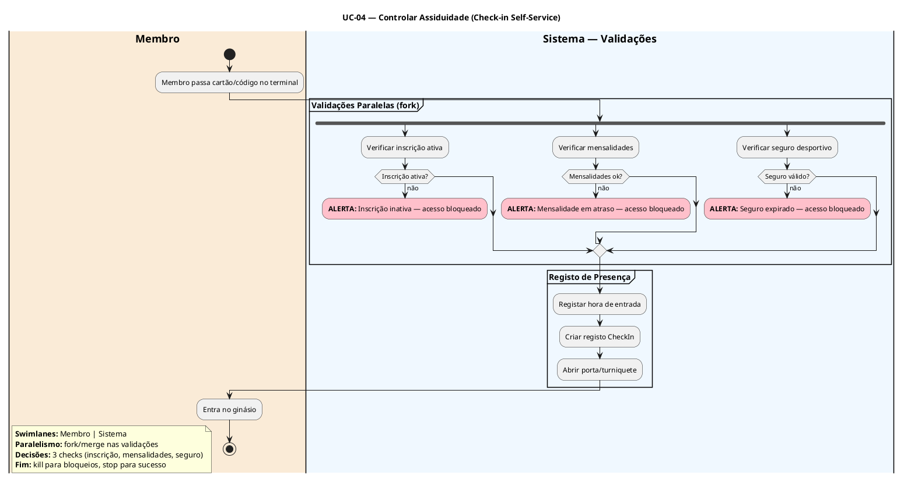

# Sistema de Gestão para Ginásio

## Modelação de Sistemas e Engenharia de Software

**Derlan Nascimento** | nº mec. 129942
**Micael Oliveira** | nº mec. 131700
**Rodrigo Fonseca** | nº mec. 131619
**Tiago Jacinto** | nº mec. 131339

_Programação de Sistema de Informação — Universidade de Aveiro_

Orientador: Professor José Martins

Águeda, 25 de março de 2026

---

## Índice

1. Introdução
2. Etapa 1 — Análise de Requisitos
   2.1. Descrição do Problema
   2.1.1. Descrição do Sistema
   2.1.2. Objetivo do Software
   2.1.3. Contexto de Utilização
   2.1.4. Principais Funcionalidades Esperadas
3. Stakeholders e Utilizadores
4. Identificação e Descrição dos Requisitos
   4.1. Requisitos Funcionais (RF)
   4.2. Requisitos Não Funcionais (RNF)
   4.3. Casos de Uso
5. Etapa 2 — Modelação Estrutural
   5.1. Diagrama de Classes
   5.2. Diagrama de Atividades

---

## 1. Introdução

Hoje em dia há cada vez mais ginásios a abrir, mas muitos ainda fazem tudo em papel. Registos manuais, folhas de presenças, envelopes com pagamentos — o que torna difícil seguir a evolução de cada Membro e ajustar Planos de Treino.

Este trabalho apresenta um sistema digital para ginásios de pequena ou média dimensão. Substitui a papelada dispersa por uma plataforma integrada: regista dados biométricos e antropométricos, permite consultar horários e avaliações remotamente, e trata de inscrições, assiduidade e pagamentos.

---

## 2. Etapa 1 — Análise de Requisitos

### 2.1. Descrição do Problema

Muitos ginásios de pequena e média dimensão ainda dependem de processos manuais em papel — registos de presenças, folhas de inscrição, envelopes com pagamentos — o que dificulta o acompanhamento da evolução de cada membro, a gestão eficiente de horários e aulas de grupo, e a emissão atempada de faturas e comprobativos de pagamento.

### 2.1.1. Descrição do Sistema

Plataforma digital centralizada que gere todos os processos operacionais de um ginásio — desde o registo de membros e avaliação física até à gestão de horários, inscrições e faturação — eliminando a dependência de processos manuais em papel.

### 2.1.2. Objetivo do Software

Automatizar e centralizar a gestão operacional do ginásio, melhorando a eficiência dos processos, garantindo a conformidade documental dos membros e proporcionando uma melhor experiência tanto aos colaboradores quanto aos utentes.

### 2.1.3. Contexto de Utilização

O sistema é utilizado em ambiente de ginásio por diversos perfis — rececionistas no controlo de acessos e atendimento, treinadores na avaliação física e prescrição de planos de treino, e administradores na gestão de inscrições, pagamentos e relatórios — operando principalmente em tablets e computadores de balcão com necessidade de resposta rápida e fiável.

### 2.1.4. Principais Funcionalidades Esperadas

- Registo de membros: criar, consultar por nome ou número, atualizar e desativar registos de Membros.
- Avaliação antropométrica: registar peso, altura, dobras cutâneas e perímetros de um Membro; cálculo automático de IMC, massa gorda (Jackson-Pollock) e VO₂ máximo (Cooper).
- Planos de treino: prescrever Exercicios personalizados com séries, repetições, carga e descanso num PlanoTreino.
- Inscrições: criar, renovar e cancelar Inscricoes em Modalidades; gestão de Contratos e Seguros Desportivos.
- Assiduidade: Check-in e Check-out por cartão ou código; cálculo automático do tempo de permanência.
- Financeiro: geração automática de Mensalidades, registo de Pagamentos totais ou parciais, emissão de Faturas e Comprovativos.
- Aulas de grupo: criar horários de AulaGrupo, reservar e cancelar vagas, controlo de lotação máxima e lista de espera.
- Modalidades: criar, consultar e desativar Modalidades com valores mensais.
- Validação documental: verificação automática da Inscricao ativa, SeguroDesportivo e exame médico antes de Check-in ou novas inscrições.
- Relatórios de faturação: compilação de receitas e valores em dívida por período.
- Autenticação e perfis de acesso: login com sessão autenticada (expiração em 30 min), hash bcrypt para passwords e controlo de acesso por perfil (Membro, Treinador, Rececionista, Contabilista, Staff, Gestor, Admin, Proprietário).

---

## 3. Stakeholders e Utilizadores

### 1. Atores Principais
| Ator | O que fazem |
| --- | --- |
| **Membro** | Paga quota, marca aulas, regista presenças, vê planos de treino e histórico |
| **Treinador** | Cria planos de treino e dieta, acompanha progresso dos membros, dá aulas coletivas e sessões PT |
| **Rececionista** | Faz check-in, atende pessoas ao balcão, processa pagamentos avulsos no POS |

### 2. Atores Secundários

| Ator | O que fazem |
| --- | --- |
| **Contabilista** | Emite faturas, cobra quotas, gere pagamentos recorrentes, gera relatórios financeiros |
| **Staff** | Apoia operações do dia-a-dia — permissões variam conforme a função |

### 3. Administradores

| Ator | O que fazem |
| --- | --- |
| **Proprietário** | Controla tudo — configurações do sistema, faturação, gestão de múltiplos locais (em chains) |
| **Gestor** | Opera o dia-a-dia — gere membros, staff, horários e relatórios |
| **Admin** | Tarefas quotidianas apenas — sem acesso a configurações de negócio |

### 4. Sistemas Externos

| Sistema | O que fazem |
| --- | --- |
| **Gateway de Pagamento** | Stripe, Razorpay, Square, GoCardless, Authorize.net — processa quotas, pagamentos avulsos e faturas |
| **Serviços de Notificação** | SMS, Email, WhatsApp — lembra renovações, notifica sobre aulas, confirma pagamentos, envia alertas |
| **Sistema de Controlo de Acesso** | Biometria, QR codes, RFID, torniquetes — autentica entrada |

---

## 4. Identificação e Descrição dos Requisitos

Os requisitos dividem-se em funcionais (o que o sistema faz) e não funcionais (como se comporta), organizados em sete domínios de negócio: gestão de utentes, avaliação física e planos de treino, inscrições/contratos/seguros, assiduidade, pagamentos/faturação, aulas de grupo e autenticação/perfis de acesso.

---

### 4.1. Requisitos Funcionais (RF)

| ID    | Título                             | Requisito funcional                                                                                                                                                                                                                               | Prioridade |
| ----- | ---------------------------------- | ------------------------------------------------------------------------------------------------------------------------------------------------------------------------------------------------------------------------------------------------- | ---------- |
| RF-01 | Criar Registo de Utente            | O Admin cria um novo utente com nome, contactos e foto. O sistema atribui um número único.                                                                                                              | Alta       |
| RF-02 | Consultar Utente por Nome         | O Admin pesquisa um utente por nome. O sistema mostra os dados guardados.                                                                                                                                                   | Alta       |
| RF-03 | Consultar Utente por Número       | O Admin pesquisa um utente pelo seu número único. O sistema mostra os dados guardados.                                                                                                                                       | Alta       |
| RF-04 | Atualizar Registo de Utente         | O Admin altera dados de um utente existente. O sistema regista a data da alteração.                                                                                                                                        | Alta       |
| RF-05 | Desativar Registo de Utente         | O Admin desativa um utente. A partir dessa data, não pode fazer novas inscrições, mas os dados antigos ficam acessíveis.                                                                                                   | Média      |
| RF-06 | Registar Avaliação Antropométrica  | O Treinador regista medidas físicas de um Membro — peso, altura, dobras cutâneas, perímetros. O sistema calcula automaticamente o IMC, a massa gorda (Jackson-Pollock) e o VO2 máximo (Cooper). **Validade: 6 meses.**                                                 | Alta       |
| RF-07 | Criar Plano de Treino               | O Treinador cria um plano de treino para um Membro, com um objetivo e uma duração.                                                                                                                                                                | Alta       |
| RF-08 | Adicionar Exercício ao Plano        | O Treinador adiciona exercícios a um plano, indicando séries, repetições, carga e descanso.                                                                                                                                                      | Alta       |
| RF-09 | Criar Inscrição em Modalidade       | O Admin cria uma inscrição associando um Membro a uma Modalidade e definindo o período de validade.                                                                                                                          | Alta       |
| RF-10 | Renovar Inscrição                   | O Admin renova uma inscrição activa antes da data de fim. O sistema actualiza o período de validade.                                                                                                                       | Alta       |
| RF-11 | Cancelar Inscrição                  | O Admin cancela uma inscrição activa. O sistema regista a data e o motivo do cancelamento.                                                                                                                                  | Média      |
| RF-12 | Registar Entrada (Check-in)        | O Membro ou a Rececionista regista a entrada no ginásio. O sistema valida que a inscrição está activa.                                                                                                                                           | Alta       |
| RF-13 | Validar e Guardar Hora de Entrada   | O sistema guarda a hora de entrada após validar que a inscrição está activa.                                                                                                                                                                        | Alta       |
| RF-14 | Registar Saída (Check-out)          | O Membro ou a Rececionista regista a saída do ginásio.                                                                                                                                                                                           | Alta       |
| RF-15 | Guardar Hora de Saída               | O sistema guarda a hora de saída.                                                                                                                                                                                                                | Alta       |
| RF-16 | Calcular Tempo de Permanência       | O sistema calcula o tempo de permanência com base na hora de entrada e saída.                                                                                                                                                                    | Alta       |
| RF-17 | Gerar Mensalidades                 | No dia 1 de cada mês, o sistema gera automaticamente as mensalidades para todos os utentes com inscrição ativa.                                                                                                                                               | Alta       |
| RF-18 | Registar Pagamento                 | A Rececionista ou o sistema regista pagamentos totais ou parciais de uma mensalidade. A mensalidade fica no estado "Pago" ou "Parcialmente Pago".                                                                                               | Alta       |
| RF-19 | Emitir Comprovativo de Pagamento   | Após a confirmação de um pagamento, o sistema gera um comprovativo em PDF.                                                                                                                                                                          | Média      |
| RF-20 | Criar Aula de Grupo                | O Treinador cria uma AulaGrupo com horário, duração, lotação máxima e Treinador, para um dia da semana. Depois de criada, a aula fica disponível para reserva.                                                                             | Alta       |
| RF-21 | Reservar Vaga em Aula              | O Membro ou a Rececionista reserva um lugar numa AulaGrupo disponível. Se a aula estiver cheia, o Membro fica em lista de espera.                                                                                                                    | Alta       |
| RF-22 | Cancelar Reserva de Aula           | O Membro ou a Rececionista cancela uma reserva antes do início da aula. O sistema liberta a vaga.                                                                                                                                               | Média      |
| RF-23 | Controlar Lotação Máxima           | O sistema impede reservas quando a lotação máxima da aula é atingida.                                                                                                                                                                            | Alta       |
| RF-24 | Compilar Dados de Faturação         | O sistema compila receitas e valores em dívida para o período seleccionado.                                                                                                                                                                       | Alta       |
| RF-25 | Gerar Relatório de Faturação       | O sistema gera um relatório consolidado de faturação para o período seleccionado.                                                                                                                                                               | Alta       |
| RF-26 | Criar Modalidade                   | O responsável administrativo cria uma modalidade com nome, descrição e valor mensal.                                                                                                                                                              | Alta       |
| RF-27 | Consultar Modalidade               | O responsável administrativo consulta os dados de uma modalidade.                                                                                                                                                                                | Alta       |
| RF-28 | Desativar Modalidade               | O responsável administrativo desactiva uma modalidade. Modalidades desativadas não podem ser usadas em novas inscrições.                                                                                                                           | Alta       |
| RF-29 | Validar Seguro para Check-in       | O sistema valida a data de validade do seguro desportivo do utente antes de permitir o check-in.                                                                                                                                                  | Alta       |
| RF-30 | Validar Seguro para Inscrições     | O sistema valida a data de validade do seguro desportivo do utente antes de permitir novas inscrições.                                                                                                                                           | Alta       |
| RF-31 | Emitir Fatura                      | Após o registo de um pagamento, o sistema gera automaticamente uma fatura com número, valor total e data de emissão.                                                                                                                    | Alta       |

---

### 4.2. Requisitos Não Funcionais (RNF)

Os RNFs abaixo são baseados nas classes do diagrama de domínio (secção 5.1) e representam padrões presentes em pelo menos 70% dos sistemas de gestão de ginásio.

| ID       | Domínio           | Título                           | Descrição                                                                                                                                                                                                                                                                 | Prioridade |
| -------- | ----------------- | -------------------------------- | -------------------------------------------------------------------------------------------------------------------------------------------------------------------------------------------------------------------------------------------------------------------------- | ---------- |
| RNF-01a | Desempenho        | Tempo de Check-in/Check-out       | O sistema processa check-in e check-out em menos de 1 segundo, utilizando os dados de CheckIn e a validação da inscrição ativa do Membro.                                                                                                                                  | Alta       |
| RNF-01b | Desempenho        | Consulta de Dados de Membro       | Consultas aos dados de Membro (Membro, AvaliacaoFisica, PlanoTreino) respondem em menos de 2 segundos.                                                                                                                                                                     | Alta       |
| RNF-01c | Desempenho        | Geração de Relatórios            | Relatórios de evolução (Relatorio) para períodos até 12 meses ficam prontos em até 30 segundos.                                                                                                                                                                            | Média      |
| RNF-02a | Segurança         | Autenticação por Password         | passwords de todos os Utilizador (Membro, Treinador, Rececionista, Admin, etc.) são guardadas com hash bcrypt.                                                                                                | Alta       |
| RNF-02b | Segurança         | Tempo de Expiração de Sessão      | Sessões autenticadas expiram após 30 minutos sem atividade. O sistema avisa 5 minutos antes do logout automático.                                                                                                                                                          | Alta       |
| RNF-02c | Segurança         | Controlo de Acesso por Perfil     | Cada pessoa tem apenas um perfil de acesso (conforme subclasses de Utilizador). Apenas o Administrador pode alterar perfis.                                                                                                                                                                   | Alta       |
| RNF-02d | Segurança         | Registo de Auditoria              | O sistema regista todas as operações sensíveis em LogAuditoria: identificador do evento, data/hora UTC, tipo de operação, utilizador, recurso afetado e resultado.                                                   | Alta       |
| RNF-02e | Segurança         | Proteção contra Vulnerabilidades   | Todos os inputs são validados e sanitizados para prevenir injeção SQL e XSS.                                                                                                                                                                                               | Alta       |
| RNF-02f | Segurança         | Backup Encriptado                 | Backups da base de dados (contendo dados de Membro, Mensalidade, Fatura, etc.) são encriptados com AES-256.                                                                                                                                                                | Alta       |
| RNF-03a | Usabilidade       | Eficiência de Interação           | Operações frequentes (criar Inscricao, Check-in, registar Pagamento) necessitam no máximo 3 cliques a partir do dashboard autenticado.                                                                                                                                     | Alta       |
| RNF-03b | Usabilidade       | Acessibilidade                    | Interface web respeita o nível AA das WCAG 2.1: contraste mínimo 4.5:1, navegação por teclado e alternativas textuais para imagens.                                                                                                                                          | Alta       |
| RNF-04a | Disponibilidade   | Disponibilidade Operativa         | Sistema disponível 98% do tempo durante horário do ginásio (08:00–22:00). Tempo máximo de indisponibilidade contínua: 30 minutos.                                                                                                                                            | Alta       |
| RNF-04b | Disponibilidade   | Recuperação após Incidente        | Após indisponibilidade durante horário de funcionamento, o sistema recupera em até 30 minutos. Administrador recebe alerta automático.                                                                                                                                     | Alta       |
| RNF-05a | Privacidade de Dados | Minimização de Dados           | O sistema recolhe apenas dados biométricos necessários para a AvaliacaoFisica e prescrição de treino. Não são recolhidos dados clínicos, genéticos ou sinais vitais avançados.                                                      | Alta       |
| RNF-05b | Privacidade de Dados | Finalidade dos Dados           | Dados biométricos são usados exclusivamente para finalidades comunicadas ao titular. Para outra finalidade, é necessário consentimento explícito.                                                                                                                            | Alta       |
| RNF-05c | Privacidade de Dados | Direitos dos Titulares         | Titulares podem aceder, corrigir ou eliminar os seus dados através de interface dedicada. Tempo médio de resolução ≤ 15 dias úteis.                                                                                                                                           | Alta       |
| RNF-05d | Privacidade de Dados | Encriptação de Dados Sensíveis   | Todos os dados biométricos (AvaliacaoFisica) e de saúde guardados na base de dados estão encriptados com AES-256.                                                                                                                                                           | Alta       |
| RNF-06a | Compatibilidade   | Compatibilidade de Browsers       | Interface web funciona nas versões mais recentes do Chrome, Firefox, Safari e Edge. Compatibilidade com Safari (iOS) e Chrome (Android).                                                                                                                                     | Média      |
| RNF-06b | Compatibilidade   | Suporte Multi-Dispositivo         | Interface responsiva para funcionar em desktops, tablets e smartphones. Funcionalidade completa em ecrãs de 320px até 2560px de largura.                                                                                                                                | Média      |
| RNF-06c | Compatibilidade   | Escalabilidade                    | O sistema suporta crescimento de pelo menos 50% no número de Membros e transações sem degradação de desempenho. Infraestrutura permite escalar horizontalmente.                                                                                                          | Média      |
| RNF-07a | Fiabilidade       | Proteção de Dados                 | O sistema mantém os dados de Membro, Inscricao e Pagamento protegidos contra perdas acidentais. Backups automáticos diários com verificação de integridade.                                                                                                                                                                     | Alta       |
| RNF-07b | Fiabilidade       | Restaurabilidade                  | Restaurabilidade total em até 4 horas a partir dos backups após desastre. Plano documentado e testado uma vez por semestre.                                                                                                                                              | Alta       |
| RNF-08a | Manutenibilidade   | Retenção de Backups               | Todos os backups mantidos durante ≥ 90 dias. Alerta automático quando algum backup ultrapassa os 85 dias.                                                                                                                                                              | Alta       |

---

### 4.3. Casos de Uso

Os casos de uso mostram a sequência de interações entre um ator e o sistema para atingir um objetivo específico.

---

#### UC-01 — Gerir Registo de Utentes

| Campo             | Valor                                                                                        |
| ----------------- | -------------------------------------------------------------------------------------------- |
| **Ator principal** | Admin |
| **Pré-condições** | Utilizador autenticado com perfil Admin. |
| **Descrição**     | Criar, consultar, editar e inativar registos de utentes.                                      |
| **Classes**       | Membro, Admin, Utilizador |

**Fluxo Principal**

1. O Admin abre o módulo de gestão de utentes.
2. Cria um novo registo ou pesquisa um existente.
3. Preenche ou atualiza os dados biográficos do Membro.
4. O sistema valida os dados e guarda o registo.

**Fluxo Alternativo**

Se houver um NIF duplicado, o sistema bloqueia a gravação e propõe abrir esse registo.

**Pós-condições** — Quando criado ou atualizado, o Membro fica pronto para inscrições e avaliações. Quando inativado, os dados mantêm-se acessíveis para consulta histórica, mas o sistema impede novas inscrições.

---

#### UC-02 — Efetuar Inscrição em Modalidade

| Campo             | Valor                                                                                       |
| ----------------- | ------------------------------------------------------------------------------------------- |
| **Ator principal** | Admin |
| **Pré-condições** | Membro registado no sistema e sem pagamentos atrasados. **Bloqueio: membros com mensalidades em atraso não podem fazer novas inscrições.** |
| **Descrição**     | Regista o Membro numa Modalidade.                                    |
| **Classes**       | Inscricao, Membro, Modalidade, Contrato, Admin |

**Fluxo Principal**

1. Selecionar o Membro registado.
2. Escolher a Modalidade e o regime de frequência.
3. Definir a data de início do vínculo.
4. O sistema cria o Contrato digital e cobra a taxa de inscrição.

**Pós-condições** — O Membro fica associado à Modalidade e fica com um débito pendente.

---

#### UC-03 — Processar Pagamento de Mensalidade

| Campo             | Valor                                                                                                                               |
| ----------------- | ----------------------------------------------------------------------------------------------------------------------------------- |
| **Ator principal** | Admin                                                                                                            |
| **Pré-condições** | Membro com mensalidades pendentes. Colaborador com acesso ao módulo financeiro.                                                   |
| **Descrição**     | Regista o pagamento das mensalidades mensais.                                                                                          |
| **Classes**       | Mensalidade, Pagamento, Fatura, Comprovativo, Membro, Admin |

**Fluxo Principal**

1. O sistema mostra as mensalidades em aberto do Membro escolhido.
2. O Admin escolhe o mês a pagar e a forma de pagamento.
3. O sistema regista a transação e gera o comprovativo.
4. A mensalidade passa para "Liquidado".

**Fluxo Alternativo**

Quando o pagamento é parcial, fica saldo devedor.
Se o pagamento falhar ou for recusado, o sistema avisa o colaborador e a mensalidade continua "Pendente".

**Pós-condições** — A mensalidade fica liquidada ou parcialmente paga, conforme o caso.

---

#### UC-04 — Controlar Assiduidade (Check-in Self-Service)

| Campo             | Valor                                                                                             |
| ----------------- | ------------------------------------------------------------------------------------------------- |
| **Ator principal** | Membro                                                                                          |
| **Pré-condições** | Membro com inscrição ativa e código ou cartão de acesso.        |
| **Descrição**     | Regista a presença do Membro nas instalações, usando um quiosque ou interface web.      |
| **Classes**       | Membro, Inscricao, Mensalidade, SeguroDesportivo, CheckIn, SistemaControloAcesso, Alerta |

**Fluxo Principal**

1. O Membro passa o código ou cartão no ponto de entrada.
2. Após confirmar que a inscrição está ativa, que a mensalidade está regularizada e que o seguro desportivo é válido, o sistema regista a hora de entrada e permite o acesso.

**Fluxo Alternativo**

Quando a mensalidade está em atraso, o sistema emite um alerta e bloqueia a entrada.
Se o seguro desportivo estiver fora da validade, aparece um alerta e o acesso é bloqueado.

**Pós-condições** — A presença fica registada no sistema.

---

#### UC-04b — Controlar Assiduidade (Check-in Assistido)

| Campo             | Valor                                                                                    |
| ----------------- | ---------------------------------------------------------------------------------------- |
| **Ator principal** | Rececionista                                                                 |
| **Pré-condições** | Membro com inscrição ativa no sistema.                                             |
| **Descrição**     | Registo da presença do Membro pela receção.                     |
| **Classes**       | Membro, Inscricao, Mensalidade, SeguroDesportivo, CheckIn, Rececionista |

**Fluxo Principal**

1. O Membro informa a receção ou apresenta o identificador de acesso.
2. A Rececionista consulta o sistema para validar a inscrição, o estado da mensalidade e o seguro.
3. O sistema regista a hora de entrada.

**Fluxo Alternativo**

Quando a mensalidade está em atraso, a Rececionista emite alerta e envia o Membro para regularizar.
Se o seguro ou a inscrição estiverem inválidos, a Rececionista encaminha o Membro para regularizar a situação.

**Pós-condições** — O sistema fica com a presença registada.

---

#### UC-05 — Gerir Contratos e Seguros Desportivos

| Campo             | Valor                                                                                              |
| ----------------- | -------------------------------------------------------------------------------------------------- |
| **Ator principal** | Admin                                                                      |
| **Pré-condições** | Membro com processo ativo no sistema.                                                     |
| **Descrição**     | Controlo da documentação legal obrigatória para a prática desportiva.                              |
| **Classes**       | Membro, Contrato, SeguroDesportivo, Alerta, Admin |

**Fluxo Principal**

1. O Admin regista ou atualiza a data de validade do exame médico e do seguro.
2. O sistema calcula a próxima data de renovação.
3. Cria-se um lembrete para 30 dias antes do prazo.

**Fluxo Alternativo**

Se a data introduzida for anterior à atual, o sistema avisa que o documento já expirou e pede uma nova data.

**Pós-condições** — O sistema guarda as datas e envia alertas quando algo está prestes a expirar.

---

#### UC-06 — Realizar Avaliação Física

| Campo             | Valor                                                                                            |
| ----------------- | ------------------------------------------------------------------------------------------------ |
| **Ator principal** | Treinador                                                                              |
| **Pré-condições** | Membro presente. Treinador com acesso ao módulo técnico.                   |
| **Descrição**     | O Treinador recolhe dados para avaliar a condição física do Membro.     |
| **Classes**       | AvaliacaoFisica, Membro, Treinador |

**Fluxo Principal**

1. O Treinador introduz peso, altura, dobras cutâneas e perímetros.
2. O sistema calcula o IMC, a percentagem de massa gorda e o VO2 máximo estimado.
3. É apresentado um relatório comparativo com a avaliação anterior, se existir.

**Fluxo Alternativo**

Quando os valores introduzidos forem biologicamente impossíveis, o sistema pede confirmação antes de guardar.

**Pós-condições** — Os dados biométricos ficam guardados no histórico do Membro e servem de base para prescrever Planos de Treino.

---

#### UC-07 — Prescrever Plano de Treino

| Campo             | Valor                                                                                                                                                          |
| ----------------- | -------------------------------------------------------------------------------------------------------------------------------------------------------------- |
| **Ator principal** | Treinador                                                                              |
| **Pré-condições** | Membro com avaliação física válida e recente. Treinador autenticado.                                                                  |
| **Descrição**     | Criar uma rotina de exercícios e atribuir a um Membro.                                                                                   |
| **Classes**       | PlanoTreino, Exercicio, Membro, Treinador |

**Fluxo Principal**

1. O Treinador seleciona exercícios disponíveis.
2. Define parâmetros: carga, repetições, séries e tempo de descanso.
3. Associa o Plano de Treino ao Membro com data de validade.
4. O sistema regista a prescrição e gera a ficha de treino.

**Pós-condições** — O Plano de Treino fica no perfil do Membro, pronto para ser consultado.

---

#### UC-08 — Consultar Histórico de Evolução

| Campo             | Valor                                                                                                                |
| ----------------- | -------------------------------------------------------------------------------------------------------------------- |
| **Ator principal** | Treinador |
| **Pré-condições** | Membro com pelo menos duas avaliações físicas registadas.                               |
| **Descrição**     | Ver como os dados biométricos do Membro mudaram ao longo do tempo.                                           |
| **Classes**       | AvaliacaoFisica, Membro, Treinador, Relatorio |

**Fluxo Principal**

1. O Treinador escolhe o Membro e pede o histórico de evolução.
2. O sistema vai buscar os dados de todas as avaliações feitas.
3. Mostra um gráfico com a evolução ao longo do tempo.
4. O Treinador pode descarregar o relatório em PDF.

**Pós-condições** — O relatório fica disponível e serve de base para ajustar os Planos de Treino.

---

#### UC-09 — Autenticar no Sistema

| Campo             | Valor                                                                                                        |
| ----------------- | ------------------------------------------------------------------------------------------------------------ |
| **Ator principal** | Qualquer utilizador registado com conta ativa.           |
| **Pré-condições** | Utilizador com conta ativa criada pelo administrador.                            |
| **Descrição**     | O utilizador introduz as suas credenciais, o sistema valida-as e cria uma sessão com acesso às funcionalidades apropriadas ao perfil.                         |
| **Classes**       | Utilizador, LogAuditoria |

**Fluxo Principal**

1. O utilizador escreve o identificador e a password.
2. Se as credenciais forem válidas e a conta estiver ativa, o sistema cria a sessão.
3. O utilizador vê as funcionalidades disponíveis para o seu perfil.

**Fluxo Alternativo**

Se as credenciais forem inválidas, o sistema recusa o acesso e mostra uma mensagem de erro.
Quando a conta está desativada, o sistema bloqueia o acesso e informa o utilizador de que deve contactar o administrador.

**Pós-condições** — A sessão fica ativa e o utilizador está no painel do seu perfil.

---

#### UC-11 — Reservar Aula de Grupo

| Campo             | Valor                                                                                                       |
| ----------------- | ----------------------------------------------------------------------------------------------------------- |
| **Ator principal** | Membro                                                                                                |
| **Descrição**     | O Membro marca presença numa AulaGrupo com lugares limitados.                                        |
| **Classes**       | Reserva, AulaGrupo, Membro |

**Fluxo Principal**

1. O Membro escolhe a aula no calendário.
2. O sistema verifica se há vagas disponíveis.
3. Se tudo correr bem, a reserva é confirmada e a lotação da AulaGrupo é atualizada.
4. **Cancelamento sem penalização: até 2h antes do início da aula. Após esse prazo, a vaga é perdida.**

**Fluxo Alternativo**

Quando a AulaGrupo está cheia, o Membro fica automaticamente numa lista de espera.

**Pós-condições** — A reserva fica confirmada e a vaga é subtraída ao inventário da AulaGrupo.

---

#### UC-12 — Gerar Relatórios de Faturação

| Campo             | Valor                                                                                                       |
| ----------------- | ----------------------------------------------------------------------------------------------------------- |
| **Ator principal** | Contabilista                                                                                          |
| **Pré-condições** | Transações financeiras registadas no período escolhido.                          |
| **Descrição**     | Extrai e consolida dados financeiros para análise de gestão.                                       |
| **Classes**       | Relatorio, Mensalidade, Pagamento, Fatura, Contabilista |

**Fluxo Principal**

1. O Contabilista escolhe o período temporal.
2. O sistema calcula o total de receitas e identifica valores em dívida.
3. Gera-se um relatório consolidado.

**Fluxo Alternativo**

Se não existirem transações no período, o sistema informa o Contabilista e não gera relatório.

**Pós-condições** — O relatório fica disponível para exportar em formato digital.

---

## 5. Etapa 2 — Modelação Estrutural

### 5.1. Diagrama de Classes

```mermaid
classDiagram
    direction TB

    class Utilizador <<Abstract>> {
        -String id
        -String nome
        -String email
        +getId() String
        +getNome() String
        +getEmail() String
        +verificarPermissao(acao String) Boolean
    }

    class Membro {
        -String telefone
        -DateTime dataInscricao
        +criar(nome, email, telefone, estado) Membro
        +getTelefone() String
        +getDataInscricao() DateTime
        +setTelefone(telefone) void
    }

    class Treinador {
        -String telefone
        -String especialidade
        +criar(nome, email, especialidade, estado) Treinador
        +getTelefone() String
        +getEspecialidade() String
        +setTelefone(telefone) void
        +setEspecialidade(especialidade) void
    }

    class Rececionista {
        +criar(nome, email, estado) Rececionista
    }

    class Contabilista {
        +criar(nome, email, estado) Contabilista
    }

    class Staff {
        -String funcao
        +criar(nome, email, funcao, estado) Staff
        +getFuncao() String
        +setFuncao(funcao) void
    }

    class Proprietario {
        +criar(nome, email, estado) Proprietario
    }

    class Gestor {
        +criar(nome, email, estado) Gestor
    }

    class Admin {
        +criar(nome, email, estado) Admin
    }

    Membro --|> Utilizador
    Treinador --|> Utilizador
    Rececionista --|> Utilizador
    Contabilista --|> Utilizador
    Staff --|> Utilizador
    Proprietario --|> Utilizador
    Gestor --|> Utilizador
    Admin --|> Utilizador

    class GatewayPagamento {
        -String nome
        -String provedor
        +criar(nome, provedor) GatewayPagamento
        +getNome() String
        +getProvedor() String
        +setProvedor(provedor) void
    }

    class ServicoNotificacao {
        -String nome
        -String canal
        +criar(nome, canal) ServicoNotificacao
        +getNome() String
        +getCanal() String
        +setCanal(canal) void
    }

    class SistemaControloAcesso {
        -String tipoAutenticacao
        +criar(tipoAutenticacao) SistemaControloAcesso
        +getTipoAutenticacao() String
        +setTipoAutenticacao(tipo) void
    }

    class Inscricao {
        -DateTime dataInicio
        -DateTime dataFim
        +criar(dataInicio, dataFim) Inscricao
        +getDataInicio() DateTime
        +getDataFim() DateTime
        +setDataFim(dataFim) void
    }

    class AvaliacaoFisica {
        -Float peso
        -Float altura
        -Float perimetro
        -Float dobrasCutaneas
        -Float imc
        -Float massaGorda
        -Float vo2max
        -DateTime dataAvaliacao
        +criar(peso, altura, dataAvaliacao) AvaliacaoFisica
        +getPeso() Float
        +getAltura() Float
        +getDataAvaliacao() DateTime
        +calcularIMC() Float
        +calcularMassaGorda() Float
        +calcularVO2max() Float
    }

    class PlanoTreino {
        -String objetivo
        -DateTime dataValidade
        +criar(objetivo, dataValidade) PlanoTreino
        +getObjetivo() String
        +getDataValidade() DateTime
    }

    class Exercicio {
        -String nome
        -String grupoMuscular
        +criar(nome, grupoMuscular) Exercicio
        +getNome() String
        +getGrupoMuscular() String
        +setGrupoMuscular(grupo) void
    }

    class AulaGrupo {
        -String horario
        -Int duracao
        -Int lotacaoMax
        +criar(horario, duracao, lotacaoMax) AulaGrupo
        +getHorario() String
        +getDuracao() Int
        +getLotacaoMax() Int
    }

    class Reserva {
        -DateTime dataReserva
        -String estadoReserva
        +criar(dataReserva) Reserva
        +getDataReserva() DateTime
        +getEstadoReserva() String
    }

    class CheckIn {
        -DateTime dataHora
        -String tipoAcesso
        +criar(dataHora, tipoAcesso) CheckIn
        +getDataHora() DateTime
        +getTipoAcesso() String
    }

    class Mensalidade {
        -Float valor
        -DateTime dataVencimento
        +criar(valor, dataVencimento) Mensalidade
        +getValor() Float
        +getDataVencimento() DateTime
    }

    class Fatura {
        -String numero
        -Float valorTotal
        -DateTime dataEmissao
        +criar(numero, valorTotal) Fatura
        +getNumero() String
        +getValorTotal() Float
        +getDataEmissao() DateTime
    }

    class Pagamento {
        -Float valor
        -DateTime dataPagamento
        -String metodo
        +criar(valor, metodo) Pagamento
        +getValor() Float
        +getDataPagamento() DateTime
        +getMetodo() String
    }

    class Contrato {
        -DateTime dataInicio
        -DateTime dataFim
        -String termos
        +criar(dataInicio, dataFim, termos) Contrato
        +getDataInicio() DateTime
        +getDataFim() DateTime
        +getTermos() String
    }

    class SeguroDesportivo {
        -DateTime dataValidade
        -String companhia
        +criar(dataValidade, companhia) SeguroDesportivo
        +getDataValidade() DateTime
        +getCompanhia() String
    }

    class Modalidade {
        -String nome
        -String descricao
        -Float valorMensal
        +criar(nome, descricao, valorMensal) Modalidade
        +getNome() String
        +getDescricao() String
        +getValorMensal() Float
    }

    class Alerta {
        -String tipo
        -String descricao
        -DateTime dataGeracao
        +criar(tipo, descricao) Alerta
        +getTipo() String
        +getDescricao() String
        +getDataGeracao() DateTime
    }

    class Relatorio {
        -String tipo
        -String periodo
        -DateTime dataGeracao
        +criar(tipo, periodo) Relatorio
        +getTipo() String
        +getPeriodo() String
        +getDataGeracao() DateTime
    }

    class LogAuditoria {
        -String tipo
        -DateTime dataHora
        -String utilizador
        -String resultado
        +criar(tipo, utilizador) LogAuditoria
        +getTipo() String
        +getDataHora() DateTime
        +getUtilizador() String
        +getResultado() String
    }

    class Comprovativo {
        -String numero
        -DateTime dataEmissao
        -Float valor
        +criar(numero, valor) Comprovativo
        +getNumero() String
        +getDataEmissao() DateTime
        +getValor() Float
    }

    Membro "1" --> "*" Inscricao : efetua
    Membro "1" --> "*" AvaliacaoFisica : recebe
    Membro "1" --> "*" PlanoTreino : recebe
    Membro "1" --> "*" Reserva : faz
    Membro "1" --> "*" CheckIn : regista
    Membro "1" --> "*" Mensalidade : tem
    Membro "1" --> "*" Alerta : recebe
    Membro "0..1" --> "1" SeguroDesportivo : possui

    Treinador "1" --> "*" Alerta : recebe
    Treinador "1" --> "*" AvaliacaoFisica : realiza
    Treinador "1" --> "*" PlanoTreino : prescreve
    Treinador "1" --> "*" AulaGrupo : orienta
    Treinador "1" --> "*" Exercicio : cria

    Rececionista "1" --> "*" CheckIn : processa
    Rececionista "1" --> "*" Pagamento : regista
    Rececionista "1" --> "*" Inscricao : gere
    Rececionista "1" --> "*" Reserva : processa

    Contabilista "1" --> "*" Fatura : emite
    Contabilista "1" --> "*" Mensalidade : gere
    Contabilista "1" --> "*" Pagamento : processa
    Contabilista "1" --> "*" Relatorio : gera

    Gestor "1" --> "*" Membro : gere
    Gestor "1" --> "*" Staff : coordena
    Gestor "1" --> "*" AulaGrupo : supervisiona
    Gestor "1" --> "*" Relatorio : consulta

    Admin "1" --> "*" Membro : gere
    Admin "1" --> "*" LogAuditoria : consulta

    Modalidade "1" --* "*" Inscricao : contem

    PlanoTreino "1" --* "*" Exercicio : contem

    AulaGrupo "1" --o "*" Reserva : contem

    Mensalidade "1" --o "*" Pagamento : contem
    Mensalidade "1" --> "1" Fatura : tem

    Pagamento "1" --> "1" Comprovativo : gera

    Inscricao "1" --> "1" Contrato : tem
    Inscricao "1" --> "1" Modalidade : pertence

    CheckIn "1..*" ..> "1" SistemaControloAcesso : utiliza
    Pagamento "1..*" ..> "1" GatewayPagamento : usa
    Alerta "1..*" ..> "1" ServicoNotificacao : usa
    SistemaControloAcesso "1" --> "*" Membro : autentica
```



#### 5.2.1. Sequência de UC-04 — Controlar Assiduidade (Check-in)

```mermaid
sequenceDiagram
```

#### 5.2.2. Sequência de UC-03 — Processar Pagamento de Mensalidade

```mermaid
sequenceDiagram
```

### 5.3. Diagrama de Atividades (UC-04)

