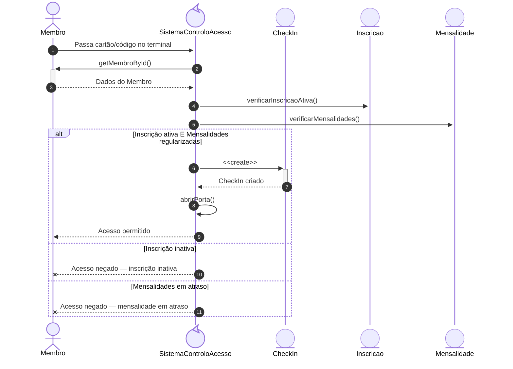
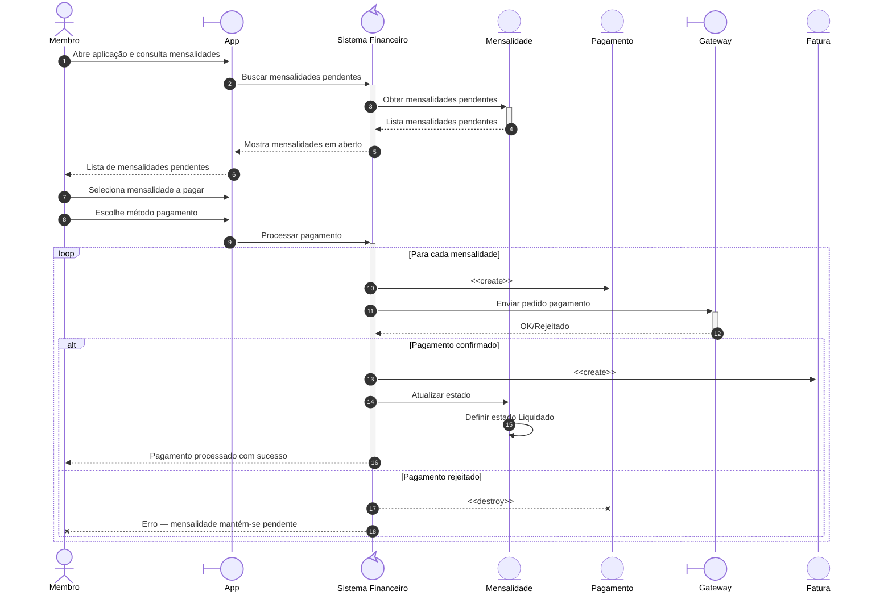
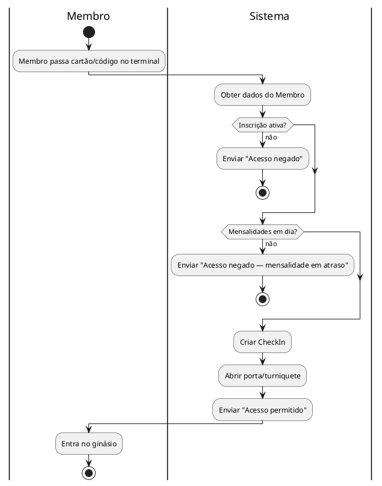

<nav id="table-of-contents">

## Índice

1. [Introdução](#1-introdução)
2. [Etapa 1 — Análise de Requisitos](#2-etapa-1--análise-de-requisitos)
   - [Descrição do Problema](#21-descrição-do-problema)
     - [Descrição do Sistema](#211-descrição-do-sistema)
     - [Objetivo do Software](#212-objetivo-do-software)
     - [Contexto de Utilização](#213-contexto-de-utilização)
     - [Principais Funcionalidades Esperadas](#214-principais-funcionalidades-esperadas)
3. [Stakeholders e Utilizadores](#3-stakeholders-e-utilizadores)
   - [Atores Principais](#atores-principais)
   - [Atores Secundários](#atores-secund%C3%A1rios)
   - [Administradores](#administradores)
   - [Sistemas Externos](#sistemas-externos)
4. [Identificação e Descrição dos Requisitos](#4-identifica%C3%A7%C3%A3o-e-descri%C3%A7%C3%A3o-dos-requisitos)
   - [Requisitos Funcionais (RF)](#41-requisitos-funcionais-rf)
   - [Requisitos Não Funcionais (RNF)](#42-requisitos-n%C3%A3o-funcionais-rnf)
5. [Casos de Uso](#43-casos-de-uso)
6. [Etapa 2 — Modelação Estrutural](#5-etapa-2--modela%C3%A7%C3%A3o-estrutural)
   - [Diagrama de Classes](#51-diagrama-de-classes)
   - [Diagramas de Sequência](#52-diagramas-de-sequência)
   - [Diagrama de Atividades](#53-diagrama-de-atividades)

</nav>

---

## 1. Introdução

Muitos ginásios, especialmente os mais pequenos, ainda funcionam com registos em papel: folhas de presença, envelopes com pagamentos, cadernos de avaliação. Isto dificulta o acompanhamento de cada membro e a gestão do dia-a-dia.

Este trabalho propõe um sistema digital para ginásios de pequena e média dimensão. A ideia é centralizar a gestão de membros, inscrições, horários de aulas, presenças e pagamentos, substituindo o papel por um sistema integrado.

---

## 2. Etapa 1 — Análise de Requisitos

### 2.1. Descrição do Problema

Ginásios de pequena e média dimensão ainda dependem de processos manuais em papel: folhas de inscrição, envelopes com pagamentos, registos de presença em caderno. O resultado é um acompanhamento irregular dos membros, horários imprevisíveis e faturas que só aparecem quando alguém se lembra de as emitir.

### 2.1.1. Descrição do Sistema

Plataforma digital centralizada que cobre todas as operações de um ginásio: registo de membros, planos de treino, gestão de horários, inscrições e faturação.

### 2.1.2. Objetivo do Software

Tornar a gestão do ginásio mais eficiente e centralizada. Na prática, significa processos mais ágeis para a equipa, documentação de membros em conformidade, e uma experiência melhor para quem treina.

### 2.1.3. Contexto de Utilização

O sistema funciona no dia-a-dia do ginásio com diferentes perfis a trabalhar em paralelo. A receção gere acessos, atendimento e pagamentos presenciais. Treinadores preenchem planos de treino. Administradores tratam de inscrições e gestão de membros. Pagamentos são processados pelo membro via app ou presencialmente no balcão com ajuda do(a) rececionista. O trabalho decorre sobretudo em tablets e computadores de balcão.

### 2.1.4. Principais Funcionalidades Esperadas

- **Membros:** criar, procurar por nome ou número, atualizar e desativar registos.
- **Planos de treino:** exercícios personalizados com séries, repetições, carga e descanso.
- **Inscrições:** criar, renovar e cancelar inscrições.
- **Assiduidade:** check-in e check-out por cartão ou código.
- **Financeiro:** mensalidades geradas automaticamente, pagamentos totais ou parciais, faturas.
- **Aulas de grupo:** horários, reservas, cancelamentos e controlo de lotação.
- **Validação automática:** a inscrição é verificada no check-in.
- **App para membros:** consulta de planos, reserva de aulas e check-in pelo telemóvel.
- **Relatórios de faturação:** receitas e valores em dívida por período.
- **Segurança:** login com sessão que expira apõs 30 min sem atividade, passwords com hash bcrypt, e acesso por tipo de Utilizador (Membro, Treinador, Rececionista, Gestor, Admin).

---

## 3. Stakeholders e Utilizadores

### Atores Principais

| Ator | O que fazem |
| --- | --- |
| **Membro** | Paga mensalidade, marca aulas, regista presenças, vê planos de treino e histórico |
| **Treinador** | Cria planos de treino, acompanha progresso dos membros, dá aulas coletivas e sessões PT |

### Atores Secundários

| Ator | O que fazem |
| --- | --- |
| **Rececionista** | Faz check-in, atende pessoas ao balcão, processa pagamentos avulsos no terminal POS |

### Administradores

| Ator | O que fazem |
| --- | --- |
| **Gestor** | Gere o dia-a-dia: membros, staff, horários e relatórios. Acesso total exceto configurações de negócio. |
| **Admin** | Faz Receção e atendimento correntes. Sem acesso a configurações de negócio. |

### Sistemas Externos

| Sistema | O que fazem |
| --- | --- |
| **Gateway de Pagamento** | Integra Stripe, Razorpay, Square, GoCardless, Authorize.net para processar mensalidades, pagamentos avulsos e faturas |
| **Serviços de Notificação** | SMS, email, WhatsApp para lembrar renovações, confirmar pagamentos e enviar alertas |

---

## 4. Identificação e Descrição dos Requisitos

Os requisitos dividem-se em funcionais (o que o sistema faz) e não funcionais (como se comporta). Estão organizados em seis áreas: gestão de membros, planos de treino, inscrições, assiduidade, pagamentos/faturação, aulas de grupo e autenticação.

---

### 4.1. Requisitos Funcionais (RF)

| ID    | Título                             | Requisito funcional                                                                                                                                                               | Prioridade |
| ----- | ---------------------------------- | --------------------------------------------------------------------------------------------------------------------------------------------------------------------------------- | ---------- |
| RF-01 | Criar Registo de Membro | O Admin cria um membro com nome, contactos e foto. O sistema atribui um número único. | Alta |
| RF-02 | Pesquisar Membro | O Admin pesquisa um membro por nome, número único ou outro critério. O sistema apresenta os dados guardados. | Alta |
| RF-04 | Atualizar Registo de Membro | O Admin altera dados de um membro. O sistema regista a data da alteração. | Alta |
| RF-05 | Desativar Registo de Membro | O Admin marca um membro como inativo. Este não pode fazer login nem novas inscrições, mas os dados ficam disponíveis para consulta histórica. | Média |
| RF-07 | Criar Plano de Treino | O Treinador cria um plano para um Membro, com um objetivo e uma duração. | Alta |
| RF-08 | Atualizar Plano de Treino | O Treinador altera um plano existente de um Membro, incluindo exercícios, séries, repetições, carga, descanso ou duração. O sistema regista a data de atualização. | Alta |
| RF-09 | Criar Inscrição | O Admin cria uma inscrição para um Membro e define o período de validade. | Alta |
| RF-10 | Renovar Inscrição | O Admin renova uma inscrição ativa antes da data de fim. | Alta |
| RF-11 | Cancelar Inscrição | O Admin cancela uma inscrição ativa. O sistema regista a data e o motivo. Se o Membro pedir cancelamento, o sistema regista-o. | Média |
| RF-12 | Atualizar Inscrição | O Admin altera dados de uma inscrição ativa — período de validade ou plano associated. O sistema regista a data da alteração. | Média |
| RF-13 | Registar Entrada (Check-in) | O Membro ou a Rececionista regista a entrada. O sistema valida a inscrição ativa e guarda a hora de entrada. | Alta |
| RF-14 | Registar Saída (Check-out) | O Membro ou a Rececionista regista a saída. O sistema guarda a hora de saída, calculando o tempo de permanência. | Alta |
| RF-15 | Terminar Sessão (Logout) | O Utilizador termina a sessão ativa. O sistema invalida o token e fecha a sessão. | Alta |
| RF-16 | Gerar Mensalidades | No dia 1 de cada mês, o sistema gera automaticamente as mensalidades para todos os membros com inscrição ativa. | Alta |
| RF-17 | Registar Pagamento | A Rececionista ou o sistema regista o pagamento de uma mensalidade. | Alta |
| RF-18 | Criar Aula de Grupo | O Treinador cria uma aula com horário, duração e Treinador. Depois, a aula fica disponível para reserva. | Alta |
| RF-19 | Reservar Vaga em Aula | O Membro ou a Rececionista reserva um lugar. Se a aula estiver cheia, o sistema avisa que não há vagas. | Alta |
| RF-20 | Cancelar Reserva de Aula | O Membro ou a Rececionista cancela antes do início, libertando a vaga. | Média |
| RF-21 | Controlar Lotação Máxima | O sistema bloqueia reservas quando a lotação máxima é atingida. | Alta |
| RF-22 | Gerar Relatório de Faturação | O sistema compila receitas e valores em dívida para o período selecionado e gera um relatório consolidado para o período. | Alta |
| RF-23 | Emitir Fatura | Após o registo de um pagamento, o sistema gera automaticamente uma fatura com número, valor e data. | Alta |

---

### 4.2. Requisitos Não Funcionais (RNF)

| ID       | Domínio           | Título                           | Descrição                                                                                                                                                                                       | Prioridade |
| -------- | ----------------- | -------------------------------- | ------------------------------------------------------------------------------------------------------------------------------------------------------------------------------------------------ | ---------- |
| RNF-01a | Desempenho | Tempo de Check-in | Check-in processado em menos de 1 segundo. | Alta |
| RNF-01b | Desempenho | Consulta de Dados de Membro | Consultas a dados de Membro respondem em menos de 2 segundos. | Alta |
| RNF-01c | Desempenho | Geração de Relatórios | Relatórios de faturação ficam prontos em até 120 segundos. | Média |
| RNF-02a | Segurança | Autenticação por Password | Passwords guardadas com hash bcrypt. | Alta |
| RNF-02b | Segurança | Tempo de Expiração de Sessão | Sessões expiram após 30 minutos sem atividade. | Alta |
| RNF-02e | Segurança | Proteção contra Vulnerabilidades | Todos os inputs são validados e sanitizados. | Alta |
| RNF-02f | Segurança | Backup Encriptado | Backups regulares com encriptação. A integridade é verificada. | Alta |
| RNF-03a | Usabilidade | Eficiência de Interação | Operações frequentes (criar Inscricao, Check-in, registar Pagamento) precisam de no máximo 3 cliques. | Alta |
| RNF-04a | Disponibilidade | Disponibilidade Operativa | Sistema disponível 95% do tempo em horário de funcionamento (08:00–22:00), 90% fora. Tempo máximo de paragem contínua: 2 horas. | Alta |
| RNF-04b | Disponibilidade | Recuperação após Incidente | Recuperação em até 2 horas durante horário de funcionamento, com alerta automático ao administrador. | Alta |
| RNF-05a | Privacidade de Dados | Minimização de Dados | O sistema recolhe apenas os dados necessários para a operação do ginásio. | Alta |
| RNF-05b | Privacidade de Dados | Finalidade dos Dados | Dados dos membros são usados exclusivamente para a gestão da inscrição e faturação. | Alta |
| RNF-05c | Privacidade de Dados | Direitos dos Titulares | Os titulares podem aceder, corrigir ou eliminar os seus dados. Tempo médio de resolução ≤ 30 dias úteis. | Alta |
| RNF-06a | Compatibilidade | Compatibilidade de Browsers | Interface web funciona nas versões mais recentes de Chrome, Firefox, Safari e Edge, incluindo Safari (iOS) e Chrome (Android). | Média |
| RNF-06b | Compatibilidade | Suporte Multi-Dispositivo | Interface responsiva para desktops, tablets e smartphones (320px a 2560px). | Média |
| RNF-06c | Compatibilidade | Escalabilidade | O sistema suporta pelo menos 50% de crescimento em membros e transações sem degradação. | Média |
| RNF-07a | Fiabilidade | Proteção de Dados | Dados protegidos contra perdas acidentais. Backups automáticos diários com verificação de integridade. | Alta |
| RNF-07b | Fiabilidade | Restaurabilidade | Restaurabilidade total em até 8 horas a partir dos backups. Plano documentado e testado anualmente. | Alta |
---

### 4.3. Casos de Uso

Os casos de uso descrevem interações típicas entre os atores e o sistema, o suficiente para entender o fluxo sem repetir o que as tabelas já dizem.

---

#### UC-01a — Criar Registo de Membro

| Campo             | Valor                                                |
| ----------------- | ---------------------------------------------------- |
| **Ator principal** | Admin                                                |
| **Pré-condições** | Utilizador autenticado com conta Admin.              |
| **Descrição**     | Cria um novo registo de membro no sistema.           |
| **Classes**       | Membro, Admin, Utilizador                            |

##### Fluxo Principal

1. O Admin abre o módulo de gestão de membros.
2. O Admin inicia a criação de um novo registo.
3. O Admin preenche os dados biográficos do novo Membro.
4. O sistema valida os dados e guarda o registo.

##### Fluxo Alternativo

Membro já existente: o sistema bloqueia a gravação e propõe abrir o registo existente.

**Pós-condições** — Registo criado e pronto para inscrições.

---

#### UC-01b — Consultar Registo de Membro

| Campo             | Valor                                                |
| ----------------- | ---------------------------------------------------- |
| **Ator principal** | Admin                                                |
| **Pré-condições** | Utilizador autenticado com conta Admin.              |
| **Descrição**     | Consulta os dados de um membro registado.             |
| **Classes**       | Membro, Admin                                        |

##### Fluxo Principal

1. O Admin abre o módulo de gestão de membros.
2. O Admin pesquisa o membro por nome, número ou outro critério.
3. O sistema apresenta os dados do membro.

**Pós-condições** — Dados do membro apresentados para consulta.

---

#### UC-01c — Editar Registo de Membro

| Campo             | Valor                                                |
| ----------------- | ---------------------------------------------------- |
| **Ator principal** | Admin                                                |
| **Pré-condições** | Membro registado no sistema.                         |
| **Descrição**     | Atualiza os dados biográficos de um membro.           |
| **Classes**       | Membro, Admin                                        |

##### Fluxo Principal

1. O Admin abre o módulo de gestão de membros.
2. O Admin pesquisa e seleciona o membro a editar.
3. O Admin atualiza os dados biográficos do Membro.
4. O sistema valida os dados e guarda o registo atualizado.

**Pós-condições** — Registo atualizado com sucesso.

---

#### UC-01d — Inativar Registo de Membro

| Campo             | Valor                                                |
| ----------------- | ---------------------------------------------------- |
| **Ator principal** | Admin                                                |
| **Pré-condições** | Membro registado no sistema.                         |
| **Descrição**     | Inativa um membro, impedindo novas inscrições.         |
| **Classes**       | Membro, Admin                                        |

##### Fluxo Principal

1. O Admin abre o módulo de gestão de membros.
2. O Admin pesquisa e seleciona o membro a inativar.
3. O Admin confirma a inativação.
4. O sistema marca o membro como inativo.

**Pós-condições** — Membro inativado; os dados mantêm-se acessíveis para consulta histórica mas impedem novas inscrições.

---

#### UC-02 — Efetuar Inscrição

| Campo             | Valor                                       |
| ----------------- | ------------------------------------------- |
| **Ator principal** | Admin |
| **Pré-condições** | Membro registado no sistema. |
| **Descrição**     | Regista o Membro para utilização do ginásio. |
| **Classes**       | Inscricao, Membro, Admin |

##### Fluxo Principal

1. Selecionar o Membro.
2. Definir a data de início e período de validade.
3. O sistema regista e cobra a taxa de inscrição.

**Pós-condições** — O Membro fica com a inscrição ativa, com um débito pendente.

---

#### UC-02b — Editar Inscrição

| Campo             | Valor                                       |
| ----------------- | ------------------------------------------- |
| **Ator principal** | Admin |
| **Pré-condições** | Inscrição ativa no sistema. |
| **Descrição**     | Altera dados de uma inscrição ativa — período de validade ou plano associated. |
| **Classes**       | Inscricao, Membro, Admin |

##### Fluxo Principal

1. O Admin pesquisa e seleciona a inscrição a editar.
2. O Admin altera o período de validade ou o plano associated.
3. O sistema valida e guarda as alterações, registando a data de atualização.

**Pós-condições** — Inscrição atualizada com sucesso.

---

#### UC-03 — Processar Pagamento de Mensalidade

| Campo             | Valor                                                                                           |
| ----------------- | ---------------------------------------------------------------------------------------------- |
| **Ator principal** | Membro                                                                                         |
| **Atores secundários** | Rececionista (apenas para assistência presencial opcional, não é obrigatória) |
| **Pré-condições** | Membro com mensalidades pendentes.                                                             |
| **Descrição** | O Membro paga uma mensalidade pendente, via app (self-service) ou presencialmente no balcão. |
| **Classes**       | Mensalidade, Pagamento, Fatura, Membro, Rececionista                                           |

##### Fluxo Principal (Self-Service via App)

1. O Membro abre a aplicação e consulta as mensalidades pendentes.
2. Escolhe o método de pagamento (cartão registado, transferência, etc.).
3. Confirma o pagamento.
4. O sistema regista a transação via gateway e a mensalidade passa para "Liquidado".

##### Fluxo Alternativo (Presencial com Rececionista)

1. O Membro dirige-se ao balcão.
2. A Rececionista identifica as mensalidades pendentes no sistema (opcional, o Membro também pode indicar).
3. O Membro efetua o pagamento (numerário ou cartão no terminal POS).
4. A Rececionista confirma o pagamento no sistema.
5. A mensalidade passa para "Liquidado".

##### Fluxo de Exceção

Se o pagamento falhar, o sistema avisa o Membro (via app ou Rececionista) e a mensalidade mantém-se "Pendente". Não há criação de fatura.

**Pós-condições** — Mensalidade liquidada e fatura gerada automaticamente.

---

#### UC-04 — Controlar Assiduidade (Check-in)

| Campo             | Valor                                                    |
| ----------------- | -------------------------------------------------------- |
| **Ator principal** | Membro ou Rececionista |
| **Pré-condições** | Membro com inscrição ativa e código ou cartão de acesso. |
| **Descrição**     | Regista a presença do Membro via quiosque, web ou receção. |
| **Classes**       | Membro, Inscricao, Mensalidade, CheckIn, SistemaControloAcesso, Rececionista |

##### Fluxo Principal (Self-Service)

1. O Membro passa o código ou cartão no terminal.
2. O sistema confirma a inscrição ativa e regista a hora de entrada.

##### Fluxo Alternativo (Assistido)

Quando alguém se dirige à receção:
1. A Rececionista valida a inscrição no sistema.
2. O sistema regista a hora de entrada.

##### Fluxo de Exceção

Inscrição inativa ou mensalidade em atraso: o sistema bloqueia o acesso e encaminha para regularizar.

**Pós-condições** — Presença registada no sistema.

---

#### UC-05 — Criar Plano de Treino

| Campo             | Valor                                                    |
| ----------------- | -------------------------------------------------------- |
| **Ator principal** | Treinador |
| **Pré-condições** | Membro registado no sistema. Treinador autenticado. |
| **Descrição**     | Cria um plano de treino e atribui-o a um Membro. |
| **Classes**       | PlanoTreino, Exercicio, Membro, Treinador |

##### Fluxo Principal

1. O Treinador seleciona exercícios e define parâmetros de treino.
2. Associa o Plano de Treino ao Membro com data de validade.
3. O sistema regista o Plano de Treino.

**Pós-condições** — Plano disponível na conta do Membro.

---

#### UC-06 — Acompanhar Planos de Treino

| Campo             | Valor                                                      |
| ----------------- | ---------------------------------------------------------- |
| **Ator principal** | Treinador |
| **Pré-condições** | Membro com pelo menos dois planos de treino registados. |
| **Descrição**     | Ver os planos de treino atribuídos a um Membro ao longo do tempo. |
| **Classes**       | Membro, PlanoTreino, Treinador |

##### Fluxo Principal

1. O Treinador escolhe o Membro e consulta os planos de treino atribuídos.
2. O sistema apresenta a lista de planos de treino com datas de validade.
3. O Treinador pode selecionar um plano para consultar os exercícios.

**Pós-condições** — Lista de planos de treino disponível para consulta.

---

#### UC-05b — Editar Plano de Treino

| Campo             | Valor                                                    |
| ----------------- | -------------------------------------------------------- |
| **Ator principal** | Treinador |
| **Pré-condições** | Plano de treino existente no sistema. Treinador autenticado. |
| **Descrição**     | Altera um plano de treino existente de um Membro. |
| **Classes**       | PlanoTreino, Exercicio, Membro, Treinador |

##### Fluxo Principal

1. O Treinador seleciona o plano de treino a editar.
2. O Treinador altera exercícios, séries, repetições, carga, descanso ou duração.
3. O sistema valida e guarda as alterações, registando a data de atualização.

##### Fluxo Alternativo

Plano já atribuído a um Membro com sessão ativa: o sistema alerta que a alteração pode afetar sessões em curso.

**Pós-condições** — Plano atualizado com sucesso e disponível na conta do Membro.

---

#### UC-07 — Autenticar no Sistema

| Campo             | Valor                                                   |
| ----------------- | ------------------------------------------------------- |
| **Ator principal** | Qualquer utilizador com conta ativa. |
| **Pré-condições** | Conta criada pelo administrador. |
| **Descrição**     | O utilizador introduz credenciais; o sistema valida e cria uma sessão com as permissões adequadas ao seu tipo de Utilizador. |
| **Classes**       | Utilizador |

##### Fluxo Principal

1. O utilizador escreve identificador e password.
2. Se as credenciais forem válidas e a conta ativa, o sistema cria a sessão.
3. O utilizador vê as funcionalidades disponíveis para o seu tipo de conta.

##### Fluxo Alternativo

Credenciais inválidas: o sistema recusa o acesso e mostra mensagem de erro.
Conta desativada: o sistema bloqueia o acesso e informa para contactar o administrador.

**Pós-condições** — Sessão ativa no painel do Utilizador.

---

#### UC-07b — Terminar Sessão (Logout)

| Campo             | Valor                                                   |
| ----------------- | ------------------------------------------------------- |
| **Ator principal** | Qualquer utilizador com sessão ativa. |
| **Pré-condições** | Sessão ativa no sistema. |
| **Descrição**     | O utilizador termina a sessão ativa. O sistema invalida o token e fecha a sessão. |
| **Classes**       | Utilizador |

##### Fluxo Principal

1. O utilizador seleciona "Terminar sessão" no menu.
2. O sistema invalida o token de sessão.
3. O sistema redireciona para o ecrã de login.

**Pós-condições** — Sessão terminada; token invalidado.

---

#### UC-08 — Reservar Aula de Grupo

| Campo             | Valor                                             |
| ----------------- | ------------------------------------------------- |
| **Ator principal** | Membro |
| **Descrição**     | O Membro marca presença numa aula com lugares limitados. |
| **Classes**       | Reserva, AulaSessao, Membro |

##### Fluxo Principal

1. O Membro escolhe a sessão no calendário.
2. O sistema verifica se há vagas.
3. Reserva confirmada e lotação atualizada.
4. Cancelamento sem penalização: até 24 horas antes. Após, a vaga é perdida.

##### Fluxo Alternativo

Aula cheia: o sistema avisa que não há vagas disponíveis.

**Pós-condições** — Reserva confirmada, vaga subtraída à lotação.

---

#### UC-09 — Gerar Relatórios de Faturação

| Campo             | Valor                                    |
| ----------------- | ---------------------------------------- |
| **Ator principal** | Gestor |
| **Pré-condições** | Existem transações financeiras no período escolhido. |
| **Descrição**     | O Gestor extrai e consolida dados financeiros. |
| **Classes**       | Relatorio, Mensalidade, Pagamento, Fatura, Gestor |

##### Fluxo Principal

1. O Gestor escolhe o período temporal.
2. O sistema calcula receitas e valores em dívida.
3. O sistema gera o relatório consolidado.

##### Fluxo Alternativo

Sem transações no período: o sistema informa e não gera relatório.

**Pós-condições** — Relatório disponível para exportar.

---

## 5. Etapa 2 — Modelação Estrutural

Esta secção apresenta a arquitetura estática do sistema: as classes que o compõem, como se relacionam entre si, e os fluxos de interação mais relevantes. É o mapa de como o sistema é organizado.

### 5.1. Diagrama de Classes

```mermaid
classDiagram
    direction BT

    class Entidade {
        +inativar() void
    }

    class Utilizador {
        -String id
        -String nome
        -String email
        +getId() String
        +getNome() String
        +getEmail() String
        +verificarPermissao(acao String) Boolean*
    }

    class Membro {
        -String telefone
        -DateTime dataInscricao
        +criar(nome, email, telefone, estado) Membro
        +getTelefone() String
        +getDataInscricao() DateTime
        +setTelefone(telefone) void
    }

    class Treinador {
        -String telefone
        -String especialidade
        +criar(nome, email, especialidade, estado) Treinador
        +getTelefone() String
        +getEspecialidade() String
        +setTelefone(telefone) void
        +setEspecialidade(especialidade) void
    }

    class Rececionista {
        +criar(nome, email, estado) Rececionista
    }

    class Gestor {
        +criar(nome, email, estado) Gestor
    }

    class Admin {
        +criar(nome, email, estado) Admin
    }

    Utilizador --|> Entidade
    Membro --|> Utilizador
    Treinador --|> Utilizador
    Rececionista --|> Utilizador
    Gestor --|> Utilizador
    Admin --|> Utilizador

    class Inscricao {
        -DateTime dataInicio
        -DateTime dataFim
        -String estado  # ativa, suspensa, cancelada
        +criar(dataInicio, dataFim, estado) Inscricao
        +getDataInicio() DateTime
        +getDataFim() DateTime
        +getEstado() String
    }

    class PlanoTreino {
        -String objetivo
        -DateTime dataValidade
        +criar(objetivo, dataValidade) PlanoTreino
        +getObjetivo() String
        +getDataValidade() DateTime
    }

    class Sala {
        -String nome
        +criar(nome) Sala
        +getNome() String
    }

    class AulaGrupo {
        -String nome
        -String nivel
        +criar(nome, nivel) AulaGrupo
        +getNome() String
        +getNivel() String
    }

    class AulaSessao {
        -DateTime data
        -String estado  -- valores: agendada, em_curso, realizada, cancelada
        -String diaSemana
        -String horaInicio
        -Int duracao
        +criar(data, estado, diaSemana, horaInicio, duracao) AulaSessao
        +getData() DateTime
        +getEstado() String
        +getDiaSemana() String
        +getHoraInicio() String
        +getDuracao() Int
    }

    class MetodoPagamento {
        -String tipo
        -String ultimo4Digitos
        -DateTime dataExpiracao
        +criar(tipo, ultimo4Digitos, dataExpiracao) MetodoPagamento
        +getTipo() String
        +getUltimo4Digitos() String
        +getDataExpiracao() DateTime
    }

    class Reserva {
        -DateTime dataReserva
        -String estadoReserva  -- valores: confirmada, cancelada, no_show
        +criar(dataReserva) Reserva
        +getDataReserva() DateTime
        +getEstadoReserva() String
    }

    class CheckIn {
        -DateTime dataHoraEntrada
        -DateTime dataHoraSaida
        +criar(dataHoraEntrada) CheckIn
        +registarSaida(dataHoraSaida) void
        +getDataHoraEntrada() DateTime
        +getDataHoraSaida() DateTime
    }

    class SistemaControloAcesso {
        -String id
        +validarAcesso(membroId String) Boolean
        +abrirPorta() void
        +getMembroById(membroId String) Membro
    }

    class Exercicio {
        -String nome
        -Int series
        -Int repeticoes
        -Float carga
        -Int descansoSegundos
        +criar(nome, series, repeticoes, carga, descansoSegundos) Exercicio
        +getNome() String
        +getSeries() Int
        +getRepeticoes() Int
        +getCarga() Float
        +getDescansoSegundos() Int
    }

    class Mensalidade {
        -Float valor
        -DateTime dataVencimento
        -String estado  -- valores: pendente, liquidado
        +criar(valor, dataVencimento) Mensalidade
        +getValor() Float
        +getDataVencimento() DateTime
        +getEstado() String
    }

    class Fatura {
        -String numero
        -Float valorTotal
        -DateTime dataEmissao
        +criar(numero, valorTotal) Fatura
        +getNumero() String
        +getValorTotal() Float
        +getDataEmissao() DateTime
    }

    class Pagamento {
        -Float valor
        -DateTime dataPagamento
        -String metodo
        +criar(valor, metodo) Pagamento
        +getValor() Float
        +getDataPagamento() DateTime
        +getMetodo() String
    }

    class Relatorio {
        -String tipo
        -String periodo
        -DateTime dataGeracao
        +criar(tipo, periodo) Relatorio
        +getTipo() String
        +getPeriodo() String
        +getDataGeracao() DateTime
        +gerar() String
    }

    Inscricao --|> Entidade
    PlanoTreino --|> Entidade
    Sala --|> Entidade
    AulaGrupo --|> Entidade
    AulaSessao --|> Entidade
    MetodoPagamento --|> Entidade
    Reserva --|> Entidade
    CheckIn --|> Entidade
    SistemaControloAcesso --|> Entidade
    Exercicio --|> Entidade
    Mensalidade --|> Entidade
    Fatura --|> Entidade
    Pagamento --|> Entidade
    Relatorio --|> Entidade

    Membro "1" --> "*" Inscricao : tem
    Membro "1" --> "*" PlanoTreino : tem
    Membro "1" --> "*" Reserva : faz
    Membro "1" --> "*" CheckIn : regista
    SistemaControloAcesso "1" --> "*" CheckIn : valida
    Membro "1" --> "*" SistemaControloAcesso : autentica

    Treinador "1" --> "*" PlanoTreino : cria

    PlanoTreino "1" --> "*" Exercicio : contem
    Exercicio "1" --> "*" PlanoTreino : pertence

    Rececionista "1" --> "*" CheckIn : assiste
    Gestor "1" --> "*" Mensalidade : revê
    Gestor "1" --> "*" Pagamento : reconcilia
    Gestor "1" --> "*" Relatorio : gera

    Gestor "1" --> "*" Membro : gere

    Admin "1" --> "*" Membro : regista

    AulaGrupo "1" --> "*" AulaSessao : gera
    AulaSessao "1" --> "1" Sala : ocorreEm
    AulaSessao "1" --> "1" Treinador : ministradaPor
    AulaSessao "1" --> "*" Reserva : contem

    Membro "1" --> "*" MetodoPagamento : tem
    Pagamento "1" --> "0..1" MetodoPagamento : utiliza

    Mensalidade "1" --> "*" Pagamento : liquidadaPor
    Pagamento "1" --> "0..1" Fatura : gera
```

### 5.2. Diagramas de Sequência

#### 5.2.1. Sequência de UC-04 — Controlar Assiduidade (Check-in)

#### 5.2.2. Sequência de UC-03 — Processar Pagamento de Mensalidade

### 5.3. Diagrama de Atividades (UC-04)

