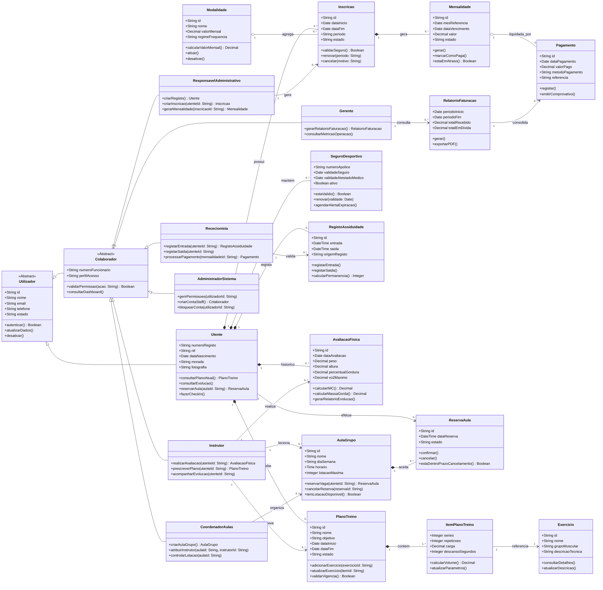
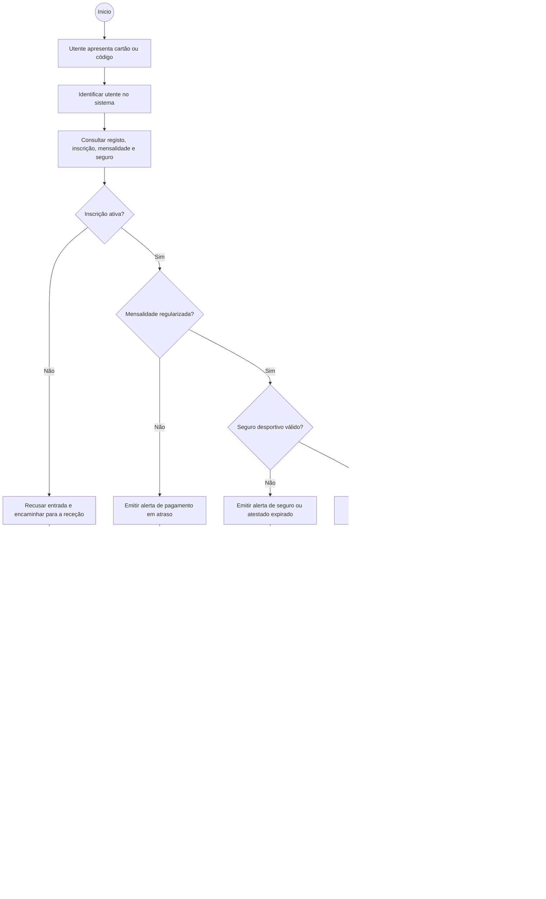

# Sistema de Gestão para Ginásio

## Modelação de Sistemas e Engenharia de Software

**Derlan Nascimento** | nº mec. 129942
**Micael Oliveira** | nº mec. 131700
**Rodrigo Fonseca** | nº mec. 131619
**Tiago Jacinto** | nº mec. 131339

_Programação de Sistema de Informação — Universidade de Aveiro_

Orientador: Professor José Martins

Águeda, 25 de março de 2026

---

## Índice

1. Introdução
2. Etapa 1 — Análise de Requisitos
   2.1. Descrição do Problema
   2.1.1. Descrição do Sistema
   2.1.2. Objetivo do Software
   2.1.3. Contexto de Utilização
   2.1.4. Principais Funcionalidades Esperadas
3. Stakeholders e Utilizadores
4. Identificação e Descrição dos Requisitos
   4.1. Requisitos Funcionais (RF)
   4.2. Requisitos Não Funcionais (RNF)
   4.3. Regras de Negócio (RN)
   4.4. Casos de Uso
5. Etapa 2 — Modelação Estrutural
   5.1. Diagrama de Classes
   5.2. Diagrama de Atividades

---

## 1. Introdução

Hoje em dia, cada vez mais pessoas valorizam a saúde e o bem-estar físico. Este aumento da procura levou ao surgimento de muitos ginásios e centros de fitness. No entanto, muitas instituições ainda usam métodos de gestão obsoletos, baseados em papel e processos manuais.

Este trabalho nasce da necessidade de digitalizar os processos de um ginásio de pequena ou média dimensão. O objetivo é passar dos registos manuais para um sistema de informação digital e integrado.

O sistema vai gerir os dados de instrutores de Educação Física e utentes. O problema principal é a dificuldade em arquivar e consultar dados quando feitos manualmente, o que impede a monitorização adequada da evolução desportiva dos utentes. Sem esta informação, os instrutores não conseguem ajustar os planos de treino de forma rápida e personalizada.

O software proposto serve como ferramenta de apoio ao instrutor de Educação Física. Permite armazenar dados biométricos e antropométricos para calcular métricas como o IMC e o VO2 Máximo. Além disso, o sistema faz o controlo administrativo: gestão de inscrições, monitorização da assiduidade e processamento de pagamentos e mensalidades.

Este projeto usa técnicas de engenharia de software e a linguagem de modelação UML (Unified Modeling Language) para especificar os requisitos e definir a arquitetura lógica do sistema. O objetivo é que a solução final permita registar dados de forma rápida e consultar horários e avaliações remotamente.

---

## 2. Etapa 1 — Análise de Requisitos

Esta primeira fase focou-se na Engenharia de Requisitos. O objetivo foi converter as necessidades operacionais de um ginásio numa especificação técnica.

Começámos por identificar os stakeholders e categorizar os diferentes níveis de interação com o sistema. Esta análise foi importante para definir as responsabilidades de cada perfil — desde o rigor técnico necessário aos instrutores na prescrição de treinos, até às necessidades de gestão e ao acesso à informação por parte dos utentes.

Os requisitos foram divididos em funcionais (o que o sistema faz) e não funcionais (como o sistema se comporta). Os requisitos funcionais detalham as operações que o sistema deve executar. Os não funcionais definem métricas de fiabilidade, usabilidade e segurança de dados — essenciais quando lidamos com informação sensível de saúde.

A priorização dos requisitos garante que as funcionalidades principais são o foco central do trabalho.

### 2.1. Descrição do Problema

O sistema proposto resolve problemas operacionais em ginásios que ainda dependem de registos em papel ou ferramentas desatualizadas. O objetivo é digitalizar o ciclo de vida do utente: desde a inscrição e controlo de assiduidade até à monitorização da sua evolução física.

Com um módulo de cálculo de métricas antropométricas, o software permite que os instrutores de Educação Física prescrevam treinos baseados em dados reais. Isto melhora o acompanhamento desportivo dos utentes e a gestão financeira da instituição.

### 2.1.1. Descrição do Sistema

O sistema de informação é uma plataforma de gestão operacional para ginásios e centros de fitness. A solução foca-se em dois pilares: a gestão administrativa/financeira e a monitorização técnico-pedagógica dos utentes.

### 2.1.2. Objetivo do Software

A gestão de um ginásio envolve muitos dados sensíveis e dinâmicos. O sistema substitui fluxos de trabalho fragmentados por uma arquitetura digital unificada.

- **Otimização do Ciclo de Vida do Utente**: Desde a inscrição inicial até à renovação de mensalidades, o estado de cada contrato é monitorizado em tempo real.
- **Rigor na Avaliação Biométrica**: O software automatiza o cálculo de índices antropométricos como IMC, percentagem de massa gorda e capacidade aeróbica (VO2 Máximo). Isto permite comparar a evolução do utente ao longo do tempo e ajustar os planos de treino com base em dados.

### 2.1.3. Contexto de Utilização

O sistema tem uma interface que separa as responsabilidades dos utilizadores. Na parte técnica, o foco é a prescrição e controlo de planos de treino — o instrutor define exercícios, intensidades e volumes adaptados a cada perfil. Na parte administrativa, o sistema gere a assiduidade (registo de entradas) e o controlo financeiro, alertando para pagamentos em atraso ou exames médicos desportivos expirados.

### 2.1.4. Principais Funcionalidades Esperadas

(! MUDAR ISTO, isto deve descrever o que o sistem deve fazer)

---

## 3. Stakeholders e Utilizadores

### Atores Principais

| Ator                         | Descrição                                                                                                                                            |
| ---------------------------- | ---------------------------------------------------------------------------------------------------------------------------------------------------- |
| Responsável Administrativo   | Gere as inscrições, pagamentos, contratos e dados dos colaboradores.                                                                                 |
| Instrutor de Educação Física | Responsável pela realização de avaliações físicas e prescrição de planos de treino.                                                                  |
| Utente                       | Interage com o sistema para registo de entradas/saídas, consulta de planos de treino, reserva de aulas de grupo e acompanhamento da evolução física. |
| Rececionista                 | Responsável pelo atendimento presencial, registo manual de entradas/saídas, gestão de reservas e atendimento ao utente.                              |
| Gerente                      | Acesso a relatórios de gestão, dashboards de desempenho e métricas de operação do ginásio.                                                           |
| Coordenador de Aulas         | Gestão de horários de aulas de grupo, atribuição de instrutores e controlo de lotação.                                                               |

### Atores Secundários

| Ator                                   | Descrição                                                                                        |
| -------------------------------------- | ------------------------------------------------------------------------------------------------ |
| Departamento Financeiro                | Acesso a relatórios de faturação, conciliação de pagamentos e análise de cobranças em atraso.    |
| Encarregado de Proteção de Dados (DPO) | Responsável pela garantia de conformidade com RGPD, especialmente para dados de saúde sensíveis. |

### Administradores

| Ator                     | Descrição                                                             |
| ------------------------ | --------------------------------------------------------------------- |
| Administrador de Sistema | Gestão de permissões, perfis de acesso e manutenção da base de dados. |

### Sistemas Externos

| Sistema               | Descrição                                                    |
| --------------------- | ------------------------------------------------------------ |
| Gateway de Pagamentos | Para processamento de mensalidades via referências externas. |
| Serviço de Email/SMS  | Para notificações de cobrança e alertas de treino.           |

---

## 4. Identificação e Descrição dos Requisitos

A especificação de requisitos define as capacidades e restrições do sistema. Estes foram segmentados em requisitos funcionais (comportamentais) e não funcionais (qualitativos).

Para manter a consistência entre requisitos, casos de uso e modelos UML, o sistema é descrito pelos mesmos domínios funcionais ao longo do documento: gestão de utentes, avaliação física e planos de treino, inscrições/contratos/seguros, assiduidade, pagamentos/faturação, aulas de grupo e autenticação/perfis de acesso.

| Domínio funcional               | Stakeholders principais                                                    | Requisitos associados | Casos de uso associados | Classes principais                            |
| ------------------------------- | -------------------------------------------------------------------------- | --------------------- | ----------------------- | --------------------------------------------- |
| Gestão de utentes               | Responsável Administrativo, Utente                                         | RF-01 a RF-04         | UC-01                   | Utente                                        |
| Avaliação física e evolução     | Instrutor de Educação Física, Utente                                       | RF-05, RF-24, RF-25   | UC-06, UC-08            | AvaliacaoFisica                               |
| Planos de treino                | Instrutor de Educação Física, Utente                                       | RF-06 a RF-08         | UC-07                   | PlanoTreino, ItemPlanoTreino, Exercicio       |
| Inscrições, contratos e seguros | Responsável Administrativo, Utente                                         | RF-09 a RF-12         | UC-02, UC-05            | Inscricao, Modalidade, SeguroDesportivo       |
| Assiduidade                     | Utente, Rececionista                                                       | RF-13 a RF-15         | UC-04                   | RegistoAssiduidade                            |
| Pagamentos e faturação          | Responsável Administrativo, Rececionista, Gerente, Departamento Financeiro | RF-16 a RF-18, RF-23  | UC-03, UC-12            | Mensalidade, Pagamento, RelatorioFaturacao    |
| Aulas de grupo e reservas       | Coordenador de Aulas, Instrutor de Educação Física, Utente                 | RF-19 a RF-22         | UC-09, UC-11            | AulaGrupo, ReservaAula                        |
| Autenticação e perfis de acesso | Administrador de Sistema, Colaboradores                                    | RN-02                 | UC-10                   | Utilizador, Colaborador, AdministradorSistema |

---

### 4.1. Requisitos Funcionais (RF)

Os requisitos funcionais descrevem as interações e serviços que o sistema deve fornecer para satisfazer os objetivos de negócio.

| ID    | Título                            | Requisito funcional                                                                                                                                                                                                                               |
| ----- | --------------------------------- | ------------------------------------------------------------------------------------------------------------------------------------------------------------------------------------------------------------------------------------------------- |
| RF-01 | Criar Registo de Utente           | [Responsável Administrativo] cria um novo utente com dados biográficos, contactos e fotografia. O sistema gera um identificador único no momento da criação.                                                                                      |
| RF-02 | Consultar Registo de Utente       | [Responsável Administrativo] pesquisa utentes por número ou nome e o sistema devolve os respetivos dados na mesma sessão.                                                                                                                         |
| RF-03 | Atualizar Registo de Utente       | [Responsável Administrativo] atualiza dados de um utente. O sistema regista a data da alteração.                                                                                                                                                  |
| RF-04 | Desativar Registo de Utente       | [Responsável Administrativo] desativa um utente. O sistema impede novas inscrições a partir dessa data, mantendo os dados existentes accessíveis.                                                                                                 |
| RF-05 | Registar Avaliação Antropométrica | [Instrutor] regista medidas físicas (peso, altura, dobras cutâneas, perímetros) na data da avaliação. O sistema calcula automaticamente o IMC, percentagem de massa gorda (Jackson-Pollock) e VO2 máximo estimado (Cooper) no momento do registo. |
| RF-06 | Criar Plano de Treino             | [Instrutor] cria um plano de treino com objetivo, duração e associação a um utente válido na data de criação.                                                                                                                                     |
| RF-07 | Adicionar Exercício ao Plano      | [Instrutor] adiciona exercícios a um plano de treino definindo séries, repetições, carga e descanso por exercício.                                                                                                                                |
| RF-08 | Editar Exercício do Plano         | [Instrutor] edita ou remove exercícios de um plano de treino ativo. O sistema recalcula o volume total do plano após cada alteração.                                                                                                              |
| RF-09 | Criar Inscrição em Modalidade     | [Responsável Administrativo] cria uma inscrição associando utente, modalidade e período de validade com data de início e fim.                                                                                                                     |
| RF-10 | Validar Documentação Desportiva   | [Sistema] verifica a data de validade do seguro desportivo e atestado médico no momento da inscrição. O sistema impede a inscrição apenas quando a data de validade já expirou na data da operação.                                               |
| RF-11 | Renovar Inscrição                 | [Responsável Administrativo] renova uma inscrição ativa antes da data de fim. O sistema associa o novo período de validade à inscrição renovada.                                                                                                  |
| RF-12 | Cancelar Inscrição                | [Responsável Administrativo] cancela uma inscrição ativa. O sistema regista a data e motivo do cancelamento, mantendo o estado "Cancelada" no histórico.                                                                                          |
| RF-13 | Registar Entrada (Check-in)       | [Utente ou Rececionista] regista entrada no ginásio na hora da ocorrência. O sistema valida que a inscrição está ativa e regista a hora de entrada.                                                                                               |
| RF-14 | Registar Saída (Check-out)        | [Utente ou Rececionista] regista saída na hora da ocorrência. O sistema regista a hora e calcula o tempo de permanência.                                                                                                                          |
| RF-15 | Registar Assiduidade              | [Sistema] compila presenças e ausências no final de cada dia com base nos registos de check-in/check-out desse dia.                                                                                                                               |
| RF-16 | Gerar Mensalidades                | [Sistema] gera mensalidades na primeira data de vencimento de cada mês para utentes com inscrição ativa nesse dia.                                                                                                                                |
| RF-17 | Registar Pagamento                | [Rececionista ou Sistema] regista pagamentos totais ou parciais. O sistema atualiza o estado da mensalidade para "Pago" ou "Parcialmente Pago" conforme o valor recebido.                                                                         |
| RF-18 | Emitir Comprovativo de Pagamento  | [Sistema] gera comprovativo de pagamento em formato PDF no momento da confirmação do pagamento.                                                                                                                                                   |
| RF-19 | Criar Aula de Grupo               | [Coordenador de Aulas] cria aulas de grupo com horário, duração, lotação máxima e instrutor associado, para um dia da semana específico.                                                                                                          |
| RF-20 | Reservar Vaga em Aula             | [Utente ou Rececionista] reserva vaga em aula disponível. O sistema verifica disponibilidade no momento da reserva e, se cheia, coloca o utente em lista de espera.                                                                               |
| RF-21 | Cancelar Reserva de Aula          | [Utente ou Rececionista] cancela reserva antes do início da aula. O sistema liberta a vaga para outro utente após o cancelamento.                                                                                                                 |
| RF-22 | Controlar Lotação Máxima          | [Sistema] impede reservas quando a lotação máxima da aula é atingida, a partir do momento em que o limite é alcançado.                                                                                                                            |
| RF-23 | Alertar Pagamentos em Atraso      | [Sistema] identifica utentes com mensalidades em atraso no dia em que o vencimento ocorre e gera alerta visível para o Responsável Administrativo a partir dessa data.                                                                            |
| RF-24 | Alertar Avaliações Expiradas      | [Sistema] identifica utentes cujas avaliações ultrapassaram o período de validade na data de consulta e gera alerta visível para o Instrutor.                                                                                                     |
| RF-25 | Relatórios de Evolução            | [Utente ou Instrutor] seleciona um período temporal ou avaliações específicas. O sistema gera relatório comparativo em formato tabular e gráfico de linha para o período selecionado.                                                             |

---

### 4.2. Requisitos Não Funcionais (RNF)

Estes requisitos definem as propriedades emergentes do sistema e as restrições a que ele está sujeito.

| ID     | Requisito                   | Descrição                                                                                                                                                                                                                                                                                                                                     |
| ------ | --------------------------- | --------------------------------------------------------------------------------------------------------------------------------------------------------------------------------------------------------------------------------------------------------------------------------------------------------------------------------------------- |
| RNF-01 | Privacidade de Dados (RGPD) | O sistema deve garantir a proteção de dados sensíveis (biométricos e de saúde) dos utentes. O acesso é restrito a perfis autorizados e os dados são tratados conforme o RGPD. Dados sensíveis devem ser encriptados em repouso e em trânsito (AES-256 mínimo), com autenticação de dois fatores (2FA) obrigatória para acesso administrativo. |
| RNF-02 | Disponibilidade do Sistema  | O sistema deve estar operacional e disponível para os utilizadores 99,9% do tempo durante o horário de funcionamento do ginásio, garantindo a continuidade do serviço mesmo em caso de falhas parciais de rede.                                                                                                                               |
| RNF-03 | Usabilidade                 | A interface deve seguir princípios de experiência de utilizador (UX) que minimizem a curva de aprendizagem, permitindo que uma inscrição seja realizada em menos de 2 minutos.                                                                                                                                                                |
| RNF-04 | Desempenho                  | O sistema deve ser capaz de suportar o acesso simultâneo de até 50 utilizadores sem degradação percetível nos tempos de resposta (máximo 2 segundos por transação).                                                                                                                                                                           |
| RNF-05 | Portabilidade               | O sistema deve ser acessível via web browser nos sistemas operativos Windows 10+, macOS 12+ e Linux, com suporte para Chrome, Firefox e Safari (versões atualizadas no último ano).                                                                                                                                                           |

---

### 4.4. Casos de Uso

A especificação de um Caso de Uso permite descrever, de forma detalhada, a sequência de interações entre um ator e o sistema para atingir um objetivo específico.

---

#### UC-01 — Gerir Registo de Utentes

| Campo             | Valor                                                                                        |
| ----------------- | -------------------------------------------------------------------------------------------- |
| **Ator**          | Responsável Administrativo                                                                   |
| **Pré-condições** | O utilizador deve estar autenticado no sistema com perfil administrativo.                    |
| **Descrição**     | Permite a manutenção (inserção, consulta, edição e inativação) dos dados mestre dos utentes. |

**Fluxo Principal**

1. O responsável administrativo acede ao módulo "Gestão de Utentes".
2. Seleciona a opção para criar um novo registo ou pesquisa um existente.
3. Preenche/edita os campos: Nome, NIF, Contacto, Morada e Data de Nascimento.
4. O sistema valida se o NIF é único e válido.
5. O sistema confirma a gravação e gera um número de registo automático.

**Fluxo Alternativo**

Se o NIF já existir, o sistema impede a gravação e sugere a consulta do registo duplicado.

**Pós-condições** — O registo do utente é atualizado na base de dados, ficando disponível para inscrições e avaliações.

---

#### UC-02 — Efetuar Inscrição em Modalidade

| Campo             | Valor                                                                               |
| ----------------- | ----------------------------------------------------------------------------------- |
| **Ator**          | Responsável Administrativo                                                          |
| **Pré-condições** | O utente deve estar previamente registado no sistema.                               |
| **Descrição**     | Formaliza o vínculo do utente a uma atividade específica (ex: Musculação, Pilates). |

**Fluxo Principal**

1. Seleção do utente previamente registado.
2. Escolha da modalidade e do respetivo regime de frequência (ex: Mensal, Trimestral).
3. Definição da data de início do vínculo contratual.
4. O sistema gera o contrato digital e a taxa de inscrição inicial.

**Fluxo Alternativo**

Se o sistema detetar que o utente tem pagamentos em atraso de inscrições anteriores, bloqueia a nova inscrição até à regularização.

**Pós-condições** — O utente é associado à modalidade e é gerado o primeiro débito financeiro.

---

#### UC-03 — Processar Pagamento de Mensalidade

| Campo             | Valor                                                                                                                                                                                   |
| ----------------- | --------------------------------------------------------------------------------------------------------------------------------------------------------------------------------------- |
| **Ator**          | Responsável Administrativo / Rececionista                                                                                                                                               |
| **Pré-condições** | O utente deve possuir mensalidades com o estado "Em Aberto" ou "Pendente" no sistema. O responsável administrativo ou rececionista deve ter privilégios de acesso ao módulo financeiro. |
| **Descrição**     | Registo da liquidação financeira das quotas mensais.                                                                                                                                    |

**Fluxo Principal**

1. O sistema apresenta as mensalidades em aberto para o utente selecionado.
2. O responsável administrativo ou rececionista seleciona o mês a liquidar e o método de pagamento.
3. O sistema regista a transação e emite o recibo de quitação.
4. O estado do utente é atualizado para "Regularizado".

**Fluxo Alternativo**

Se o pagamento for parcial, o sistema regista o valor entregue e mantém o saldo devedor para o mês em questão.

**Pós-condições** — O estado da mensalidade é alterado para "Liquidado" ou "Regularizado".

---

#### UC-04 — Controlar Assiduidade (Check-in)

| Campo             | Valor                                                                                   |
| ----------------- | --------------------------------------------------------------------------------------- |
| **Ator**          | Utente (via interface de entrada) / Rececionista                                        |
| **Pré-condições** | O utente deve possuir uma inscrição ativa e um identificador de acesso (código/cartão). |
| **Descrição**     | Registo da presença do utente nas instalações.                                          |

**Fluxo Principal**

1. O utente introduz o seu código ou utiliza o cartão de acesso.
2. O sistema verifica o estado do contrato e do seguro desportivo.
3. O sistema valida o acesso e regista a hora de entrada.

**Fluxo Alternativo**

Se o seguro desportivo estiver expirado, o sistema emite um alerta visual e solicita que o utente se dirija à receção.

**Pós-condições** — A presença é contabilizada no mapa de assiduidade do utente.

---

#### UC-05 — Gerir Contratos e Seguros Desportivos

| Campo             | Valor                                                                 |
| ----------------- | --------------------------------------------------------------------- |
| **Ator**          | Responsável Administrativo                                            |
| **Pré-condições** | O utente deve ter um processo ativo no sistema.                       |
| **Descrição**     | Controlo da documentação legal obrigatória para a prática desportiva. |

**Fluxo Principal**

1. O responsável administrativo faz o upload ou regista a data de validade do novo exame médico/seguro.
2. O sistema calcula a próxima data de renovação.
3. O sistema agenda um alerta para 30 dias antes da expiração.

**Pós-condições** — As datas de validade legal são atualizadas e o sistema gera alertas de expiração.

---

#### UC-06 — Realizar Avaliação Física

| Campo             | Valor                                                                                    |
| ----------------- | ---------------------------------------------------------------------------------------- |
| **Ator**          | Instrutor de Educação Física                                                             |
| **Pré-condições** | O utente deve estar presente e o instrutor deve ter acesso ao módulo técnico.            |
| **Descrição**     | Recolha de métricas de saúde e desempenho, enquanto domínio técnico central do trabalho. |

**Fluxo Principal**

1. Introdução de dados: Peso, Altura, Dobras Cutâneas e Perímetros.
2. O sistema executa as fórmulas de cálculo (IMC, % Gordura, Massa Magra).
3. O sistema gera um relatório comparativo com a avaliação anterior.

**Fluxo Alternativo**

Se os valores introduzidos forem biologicamente impossíveis (erro de digitação), o sistema solicita confirmação.

**Pós-condições** — O novo perfil biométrico é gravado no histórico do utente, permitindo a atualização do plano de treino.

---

#### UC-07 — Prescrever Plano de Treino

| Campo             | Valor                                                                                                                                           |
| ----------------- | ----------------------------------------------------------------------------------------------------------------------------------------------- |
| **Ator**          | Instrutor de Educação Física                                                                                                                    |
| **Pré-condições** | O utente deve ter uma avaliação física válida e recente registada no sistema. O instrutor deve estar devidamente autenticado no perfil técnico. |
| **Descrição**     | Definição da rotina de exercícios personalizada.                                                                                                |

**Fluxo Principal**

1. O instrutor seleciona exercícios da base de dados (ex.: Supino, Agachamento).
2. Define carga, repetições, séries e tempo de descanso.
3. Associa o plano ao perfil do utente com uma validade prevista.
4. O sistema gera uma ficha de treino digital/impressa.

**Fluxo Alternativo**

O sistema atualiza a data da última prescrição para fins de auditoria.

**Pós-condições** — O plano de treino fica associado à ficha digital do utente e disponível para consulta.

---

#### UC-08 — Consultar Histórico de Evolução

| Campo             | Valor                                                                                                          |
| ----------------- | -------------------------------------------------------------------------------------------------------------- |
| **Ator**          | Instrutor / Utente                                                                                             |
| **Pré-condições** | Devem existir, no mínimo, dois registos de avaliação física no histórico do utente para permitir a comparação. |
| **Descrição**     | Visualização gráfica do progresso ao longo do tempo.                                                           |

**Fluxo Principal**

1. O sistema extrai dados de todas as avaliações passadas.
2. Gera gráficos de linha mostrando a evolução do peso e massa muscular.
3. Permite a exportação do relatório para formato PDF.

**Pós-condições** — O sistema gera uma visualização gráfica temporal dos dados biométricos.

---

#### UC-09 — Gerir Mapa de Aulas de Grupo

| Campo             | Valor                                                                               |
| ----------------- | ----------------------------------------------------------------------------------- |
| **Ator**          | Responsável Administrativo / Coordenador de Aulas                                   |
| **Pré-condições** | O utilizador deve ter perfil de Coordenador de Aulas ou Responsável Administrativo. |
| **Descrição**     | Organização do calendário semanal de aulas.                                         |

**Fluxo Principal**

1. Definição de horário, sala, instrutor e lotação máxima para cada aula.
2. O sistema publica o mapa para consulta e reservas.

**Pós-condições** — O horário fica visível para todos os utentes e disponível para reservas.

---

#### UC-10 — Efetuar Autenticação (Login)

| Campo             | Valor                                                                           |
| ----------------- | ------------------------------------------------------------------------------- |
| **Ator**          | Todos os colaboradores                                                          |
| **Pré-condições** | O utilizador deve possuir uma conta ativa criada pelo Administrador de Sistema. |
| **Descrição**     | Garantia de segurança e acesso restrito.                                        |

**Fluxo Principal**

1. Introdução de credenciais (utilizador e password).
2. O sistema valida no servidor aplicacional.
3. O sistema liberta as funcionalidades de acordo com o perfil do colaborador.

**Pós-condições** — É estabelecida uma sessão segura e o utilizador é redirecionado para o painel correspondente ao seu nível de acesso.

---

#### UC-11 — Reservar Vaga em Aula de Grupo

| Campo             | Valor                                                                       |
| ----------------- | --------------------------------------------------------------------------- |
| **Ator**          | Utente (via Quiosque ou interface Web)                                      |
| **Pré-condições** | A aula de grupo deve estar publicada no mapa semanal com vagas disponíveis. |
| **Descrição**     | Marcação prévia de presença em aulas com limite de vagas.                   |

**Fluxo Principal**

1. O utente escolhe a aula no calendário.
2. O sistema verifica se ainda existem vagas disponíveis.
3. O sistema confirma a reserva e abate uma vaga no inventário da aula.

**Fluxo Alternativo**

Se a aula estiver cheia, o sistema oferece a opção de "Lista de Espera".

**Pós-condições** — A reserva é confirmada e o número de vagas disponíveis na aula é decrementado.

---

#### UC-12 — Gerar Relatórios de Faturação

| Campo             | Valor                                                                             |
| ----------------- | --------------------------------------------------------------------------------- |
| **Ator**          | Gerente / Departamento Financeiro                                                 |
| **Pré-condições** | Devem existir registos de transações financeiras no período temporal selecionado. |
| **Descrição**     | Extração de dados financeiros para análise de gestão.                             |

**Fluxo Principal**

1. Seleção do período (exemplo: Mês de Março).
2. O sistema soma todos os pagamentos recebidos e identifica os valores em dívida.
3. Emissão de um relatório consolidado de receitas.

**Pós-condições** — O sistema exporta um documento consolidado com o balanço de receitas e dívidas pendentes.

---

## 5. Etapa 2 — Modelação Estrutural

### 5.1. Diagrama de Classes

O diagrama de classes representa a estrutura lógica do sistema de gestão do ginásio, identificando as classes principais, os seus atributos, métodos e relações. Inclui associações, agregações, composições, multiplicidades e herança quando aplicável. Este modelo não representa diretamente a base de dados, mas sim os conceitos e responsabilidades do domínio do sistema.

### 5.2. Diagrama de Atividades

O diagrama de atividades seguinte modela o fluxo de execução do processo de check-in de um utente no Sistema de Gestão para Ginásio. Este processo foi escolhido por envolver regras de negócio críticas, nomeadamente a validação da inscrição ativa, da mensalidade regularizada e do seguro desportivo válido antes de permitir o acesso às instalações.

Em Mermaid, este fluxo é representado com `flowchart`, por ser a sintaxe adequada para modelar processos, decisões e caminhos paralelos. As decisões são representadas por nós em forma de losango e o paralelismo é representado através de pontos de fork/join para sincronizar atividades executadas após a autorização de entrada.

