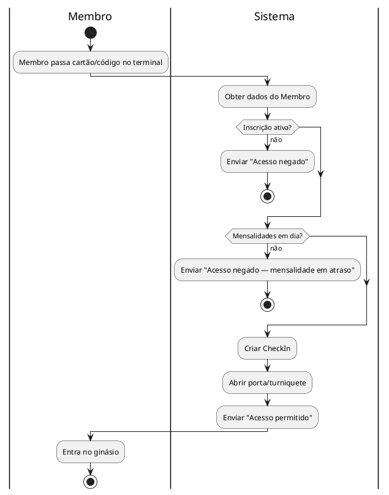

```plantuml
@startuml
|Membro|
start
:Membro passa cartão/código no terminal;

|Sistema|
:Obter dados do Membro;
if (Inscrição ativa?) then (não)
    :Enviar "Acesso negado";
    stop
endif
if (Mensalidades em dia?) then (não)
    :Enviar "Acesso negado — mensalidade em atraso";
    stop
endif
:Criar CheckIn;
:Abrir porta/turniquete;
:Enviar "Acesso permitido";

|Membro|
:Entra no ginásio;
stop
@enduml
```
0