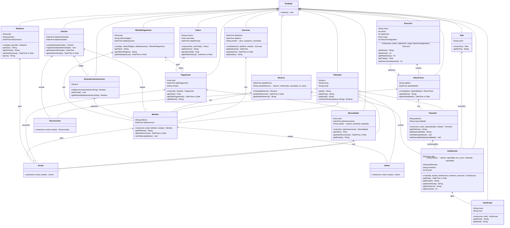

```mermaid
classDiagram
    direction BT

    class Entidade {
        +inativar() void
    }

    class Utilizador {
        -String id
        -String nome
        -String email
        +getId() String
        +getNome() String
        +getEmail() String
        +verificarPermissao(acao String) Boolean*
    }

    class Membro {
        -String telefone
        -DateTime dataInscricao
        +criar(nome, email, telefone, estado) Membro
        +getTelefone() String
        +getDataInscricao() DateTime or Date
        +setTelefone(telefone) void
    }

    class Treinador {
        -String telefone
        -String especialidade
        +criar(nome, email, especialidade, estado) Treinador
        +getTelefone() String
        +getEspecialidade() String
        +setTelefone(telefone) void
        +setEspecialidade(especialidade) void
    }

    class Rececionista {
        +criar(nome, email, estado) Rececionista
    }

    class Gestor {
        +criar(nome, email, estado) Gestor
    }

    class Admin {
        +criar(nome, email, estado) Admin
    }

    Utilizador --|> Entidade
    Membro --|> Utilizador
    Treinador --|> Utilizador
    Rececionista --|> Utilizador
    Gestor --|> Utilizador
    Admin --|> Utilizador

    class Inscricao {
        -DateTime dataInicio
        -DateTime dataFim
        -String estado  -- ativa, suspensa, cancelada
        +criar(dataInicio, dataFim, estado) Inscricao
        +getDataInicio() DateTime
        +getDataFim() DateTime or Date
        +getEstado() String
    }

    class PlanoTreino {
        -String objetivo
        -DateTime dataValidade
        +criar(objetivo, dataValidade) PlanoTreino
        +getObjetivo() String
        +getDataValidade() DateTime or Date
    }

    class Sala {
        -String nome
        +criar(nome) Sala
        +getNome() String
    }

    class AulaGrupo {
        -String nome
        -String nivel
        +criar(nome, nivel) AulaGrupo
        +getNome() String
        +getNivel() String
    }

    class AulaSessao {
        -DateTime data
        -String estado  -- valores: agendada, em_curso, realizada, cancelada
        -String diaSemana
        -String horaInicio
        -Int duracao
        +criar(data, estado, diaSemana, horaInicio, duracao) AulaSessao
        +getData() DateTime or Date
        +getEstado() String
        +getDiaSemana() String
        +getHoraInicio() String
        +getDuracao() Int
    }

    class MetodoPagamento {
        -String tipo
        -String ultimo4Digitos
        -DateTime dataExpiracao
        +criar(tipo, ultimo4Digitos, dataExpiracao) MetodoPagamento
        +getTipo() String
        +getUltimo4Digitos() String
        +getDataExpiracao() DateTime or Date
    }

    class Reserva {
        -DateTime dataReserva
        -String estadoReserva  -- valores: confirmada, cancelada, no_show
        +criar(dataReserva) Reserva
        +getDataReserva() DateTime or Date
        +getEstadoReserva() String
    }

    class CheckIn {
        -DateTime dataHoraEntrada
        -DateTime dataHoraSaida
        +criar(dataHoraEntrada) CheckIn
        +registarSaida(dataHoraSaida) void
        +getDataHoraEntrada() DateTime
        +getDataHoraSaida() DateTime or Date
    }

    class SistemaControloAcesso {
        -String id
        +validarAcesso(membroId String) Boolean
        +abrirPorta() void
        +getMembroById(membroId String) Membro
    }

    class Exercicio {
        -String nome
        -Int series
        -Int repeticoes
        -Float carga
        -Int descansoSegundos
        +criar(nome, series, repeticoes, carga, descansoSegundos) Exercicio
        +getNome() String
        +getSeries() Int
        +getRepeticoes() Int
        +getCarga() Float
        +getDescansoSegundos() Int
    }

    class Mensalidade {
        -Float valor
        -DateTime dataVencimento
        -String estado  -- valores: pendente, liquidado
        +criar(valor, dataVencimento) Mensalidade
        +getValor() Float
        +getDataVencimento() DateTime or Date
        +getEstado() String
    }

    class Fatura {
        -String numero
        -Float valorTotal
        -DateTime dataEmissao
        +criar(numero, valorTotal) Fatura
        +getNumero() String
        +getValorTotal() Float
        +getDataEmissao() DateTime or Date
    }

    class Pagamento {
        -Float valor
        -DateTime dataPagamento
        -String metodo
        +criar(valor, metodo) Pagamento
        +getValor() Float
        +getDataPagamento() DateTime or Date
        +getMetodo() String
    }

    class Relatorio {
        -String tipo
        -String periodo
        -DateTime dataGeracao
        +criar(tipo, periodo) Relatorio
        +getTipo() String
        +getPeriodo() String
        +getDataGeracao() DateTime or Date
        +gerar() String
    }

    Inscricao --|> Entidade
    PlanoTreino --|> Entidade
    Sala --|> Entidade
    AulaGrupo --|> Entidade
    AulaSessao --|> Entidade
    MetodoPagamento --|> Entidade
    Reserva --|> Entidade
    CheckIn --|> Entidade
    SistemaControloAcesso --|> Entidade
    Exercicio --|> Entidade
    Mensalidade --|> Entidade
    Fatura --|> Entidade
    Pagamento --|> Entidade
    Relatorio --|> Entidade

    Membro "1" --> "*" Inscricao : tem
    Membro "1" --> "*" PlanoTreino : tem
    Membro "1" --> "*" Reserva : faz
    Membro "1" --> "*" CheckIn : regista
    SistemaControloAcesso "1" --> "*" CheckIn : valida
    Membro "1" --> "*" SistemaControloAcesso : autentica

    Treinador "1" --> "*" PlanoTreino : cria

    PlanoTreino "1" --> "*" Exercicio : contem
    Exercicio "1" --> "*" PlanoTreino : pertence

    Rececionista "1" --> "*" CheckIn : assiste
    Gestor "1" --> "*" Mensalidade : revê
    Gestor "1" --> "*" Pagamento : reconcilia
    Gestor "1" --> "*" Relatorio : gera

    Gestor "1" --> "*" Membro : gere

    Admin "1" --> "*" Membro : regista

    AulaGrupo "1" --> "*" AulaSessao : gera
    AulaSessao "1" --> "1" Sala : ocorreEm
    AulaSessao "1" --> "1" Treinador : ministradaPor
    AulaSessao "1" --> "*" Reserva : contem

    Membro "1" --> "*" MetodoPagamento : tem
    Pagamento "1" --> "0..1" MetodoPagamento : utiliza

    Mensalidade "1" --> "*" Pagamento : liquidadaPor
    Pagamento "1" --> "0..1" Fatura : gera
```
