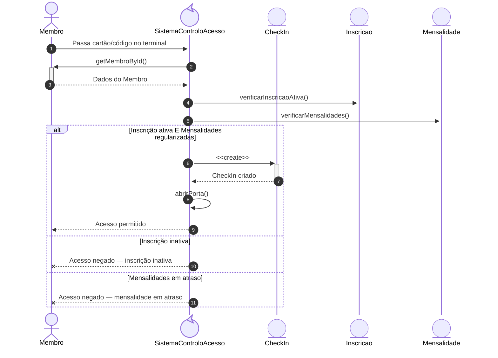

```mermaid
sequenceDiagram
    autonumber

    actor Membro
    participant SistemaControloAcesso@{ "type" : "control" }
    participant CheckIn@{ "type" : "entity" }
    participant Inscricao@{ "type" : "entity" }
    participant Mensalidade@{ "type" : "entity" }

    Membro->>+SistemaControloAcesso: Passa cartão/código no terminal
    SistemaControloAcesso->>+Membro: getMembroById()
    Membro-->>-SistemaControloAcesso: Dados do Membro

    SistemaControloAcesso->>+Inscricao: verificarInscricaoAtiva()
    SistemaControloAcesso->>+Mensalidade: verificarMensalidades()

    alt Inscrição ativa E Mensalidades regularizadas
        SistemaControloAcesso->>+CheckIn: <<create>>
        CheckIn-->>-SistemaControloAcesso: CheckIn criado
        SistemaControloAcesso->>+SistemaControloAcesso: abrirPorta()
        SistemaControloAcesso-->>Membro: Acesso permitido
    else Inscrição inativa
        SistemaControloAcesso--xMembro: Acesso negado — inscrição inativa
    else Mensalidades em atraso
        SistemaControloAcesso--xMembro: Acesso negado — mensalidade em atraso
    end
```
