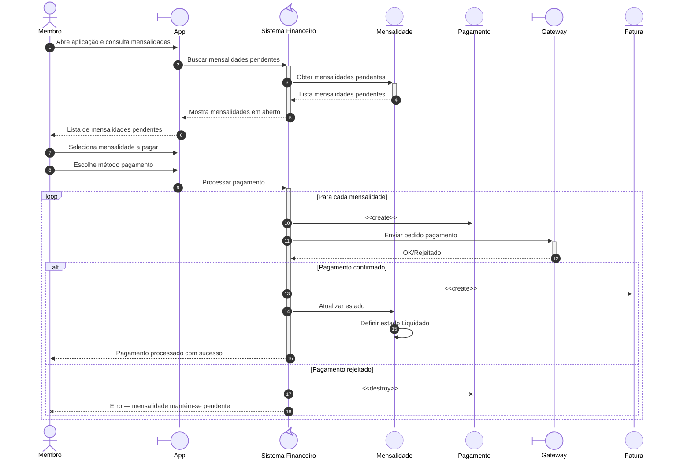

```mermaid
sequenceDiagram
    autonumber

    actor Membro
    participant App@{ "type" : "boundary" }
    participant SisFinanceiro@{ "type" : "control" } as Sistema Financeiro
    participant Mensalidade@{ "type" : "entity" }
    participant Pagamento@{ "type" : "entity" }
    participant Gateway@{ "type" : "boundary" }
    participant Fatura@{ "type" : "entity" }

    Membro->>+App: Abre aplicação e consulta mensalidades
    App->>+SisFinanceiro: Buscar mensalidades pendentes
    SisFinanceiro->>+Mensalidade: Obter mensalidades pendentes
    Mensalidade-->>-SisFinanceiro: Lista mensalidades pendentes
    SisFinanceiro-->>-App: Mostra mensalidades em aberto
    App-->>Membro: Lista de mensalidades pendentes

    Membro->>App: Seleciona mensalidade a pagar
    Membro->>App: Escolhe método pagamento
    App->>+SisFinanceiro: Processar pagamento

    loop Para cada mensalidade
        SisFinanceiro->>+Pagamento: <<create>>
        SisFinanceiro->>+Gateway: Enviar pedido pagamento
        Gateway-->>-SisFinanceiro: OK/Rejeitado

        alt Pagamento confirmado
            SisFinanceiro->>+Fatura: <<create>>
            SisFinanceiro->>Mensalidade: Atualizar estado
            Mensalidade->>Mensalidade: Definir estado Liquidado
            SisFinanceiro-->>-Membro: Pagamento processado com sucesso
        else Pagamento rejeitado
            SisFinanceiro--xPagamento: <<destroy>>
            SisFinanceiro--xMembro: Erro — mensalidade mantém-se pendente
        end
    end
```
